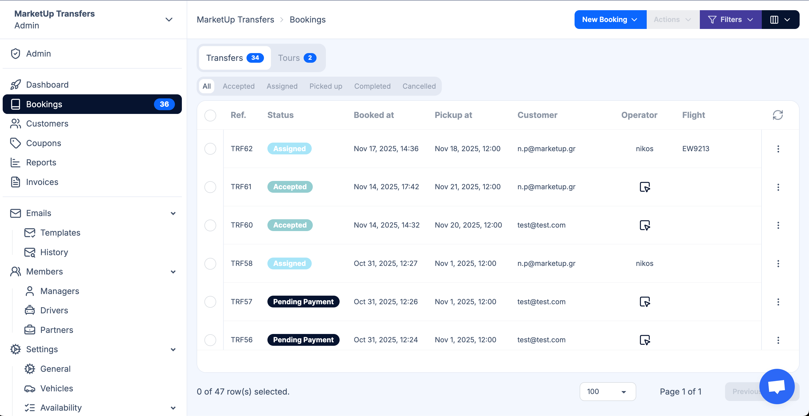

# Buchungen

Der Bereich **Buchungen** ermöglicht es Ihnen, alle Ihre Transfer- und Tourreservierungen an einem Ort zu verwalten. Er bietet Werkzeuge, um Buchungen effizient zu überprüfen, zu filtern und Ressourcen zuzuweisen.

---

## Buchungen überprüfen

Sie können jede Buchung prüfen, um alle Details einzusehen. Buchungen enthalten Informationen wie:

- Name des Kunden  
- Flugdaten (Ankunft/Abflug)  
- Ziel und Abholort  
- Name des Partners, der den Transfer oder die Tour gebucht hat  
- Transfer-/Tourtyp  
- Status und Uhrzeit  

---

## Buchungen filtern

Um bestimmte Buchungen schnell zu finden, können Sie nach folgenden Kriterien filtern:

- **Kunde** – Buchungen für einen bestimmten Passagier anzeigen  
- **Operator / Partner** – Buchungen eines bestimmten Partnerunternehmens einsehen  
- **Flug** – nach Flugnummer oder Ankunfts-/Abflugzeiten filtern  
- **Zielort** – nach dem Zielort filtern  
- **Abholort** – nach Abholort oder buchendem Partner filtern  
- **Weitere Details** – nach Status, Datum oder Serviceart filtern  

Filter erleichtern die Verwaltung großer Buchungsmengen und stellen sicher, dass nichts übersehen wird.

---

## Fahrer- und Partnerzuweisung

Sie können entweder einen **Fahrer** oder einen **Partneroperator** für die Bearbeitung einer Buchung zuweisen. Jeder arbeitet etwas anders:

### 1. Fahrer zuweisen

- Wenn Sie einen **Fahrer** zuweisen, erhält er Zugriff auf Transfervista mit seiner eigenen Benutzeransicht.  
- Der Fahrer kann die ihm zugewiesenen Buchungen sehen und auf einen Button klicken, um **die Abholung als abgeschlossen zu markieren** und **den Transfer zu bestätigen**.  
- Dies sorgt für Echtzeit-Tracking und Updates innerhalb der Plattform, sodass Sie jederzeit den Status der Transfers sehen.

### 2. Partneroperator zuweisen

- Wenn Sie einen **Partneroperator** (ein Unternehmen, das Transfers übernimmt) zuweisen, hat jedes Unternehmen möglicherweise eine eigene Flotte und eigene Fahrer.  
- Transfervista sendet eine **E-Mail-Benachrichtigung** an das Unternehmen, damit es die Buchung akzeptiert.  
- In diesem Fall verfolgt Transfervista **nicht die Abholung oder den Transfer**, da das Unternehmen seine Fahrer eigenständig verwaltet.  
- Dies ermöglicht externen Unternehmen, Transfers durchzuführen, ohne ihre internen Abläufe preiszugeben, während Sie dennoch verfolgen können, welche Buchungen zugewiesen wurden.

---

## Zusammenfassung

Der Bereich Buchungen bietet volle Kontrolle über:

- Überprüfung aller Buchungen  
- Filterung nach Kunde, Operator, Flug, Abholort, Zielort und weiteren Details  
- Zuweisung von Fahrern für Echtzeit-Tracking  
- Zuweisung von Partneroperatoren für externe Verwaltung  

Die richtige Nutzung dieses Bereichs stellt sicher, dass Ihre Transfers und Touren effizient verwaltet und korrekt nachverfolgt werden.
