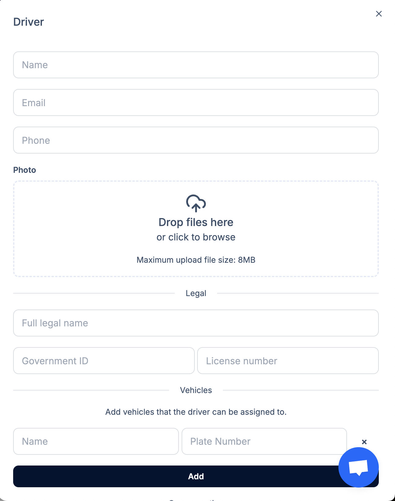

---

title: Ρύθμιση Λογαριασμού

description: Οδηγός βήμα προς βήμα για να ρυθμίσετε τον λογαριασμό σας στο Transfervista για πρώτη φορά.

---

# Πώς να ξεκινήσετε

Αυτός ο οδηγός θα σας καθοδηγήσει στα βασικά βήματα που χρειάζονται για να ρυθμίσετε την επιχείρησή σας στο Transfervista. Ολοκληρώνοντας τα παρακάτω βήματα, θα διασφαλίσετε ότι ο λογαριασμός σας είναι πλήρως λειτουργικός και έτοιμος να δεχθεί κρατήσεις.

---

## 1. Προσθέστε τους Οδηγούς σας

Οι οδηγοί είναι τα άτομα που ολοκληρώνουν τις μεταφορές και κάθε οδηγός μπορεί να έχει προσωπικά στοιχεία, νομικές πληροφορίες και εκχωρημένα οχήματα.

Όταν κάνετε κλικ στο **Προσθήκη Οδηγού**, θα εμφανιστεί μια φόρμα όπως η παρακάτω:

### Τι μπορείτε να προσθέσετε για κάθε οδηγό

#### **Βασικές Πληροφορίες**

Μπορείτε να εισάγετε:

- **Όνομα**

- **Email**

- **Τηλέφωνο**

Αυτό επιτρέπει στους οδηγούς να λαμβάνουν ειδοποιήσεις κρατήσεων και να παραμένουν σε επαφή με την ομάδα σας.

#### **Φωτογραφία Οδηγού**

Μπορείτε να ανεβάσετε φωτογραφία οδηγού:

- Σύροντας μια εικόνα στην περιοχή ανεβάσματος, ή  

- Κάνοντας κλικ για να περιηγηθείτε στα αρχεία (μέγιστο μέγεθος: 8MB)

Οι φωτογραφίες βοηθούν στην εσωτερική αναγνώριση και στη διαφάνεια προς τους πελάτες.

#### **Νομικές Πληροφορίες**

Μπορείτε επίσης να προσθέσετε προαιρετικά νομικά στοιχεία:

- **Πλήρες νομικό όνομα**

- **Αριθμός ταυτότητας / διαβατηρίου**

- **Αριθμός άδειας οδήγησης**

Αυτά τα πεδία βοηθούν στη διατήρηση της επαληθευμένης τεκμηρίωσης οργανωμένη και στη συμμόρφωση με τις τοπικές ρυθμίσεις.

#### **Εκχωρημένα Οχήματα**

Μπορείτε να αναθέσετε οχήματα στον οδηγό προσθέτοντας:

- **Όνομα οχήματος**

- **Αριθμός πινακίδας**

Αυτό διασφαλίζει ότι το σύστημα γνωρίζει ποια οχήματα μπορεί να χρησιμοποιεί κάθε οδηγός κατά τον προγραμματισμό των μεταφορών.

Μετά την ολοκλήρωση των λεπτομερειών, κάντε κλικ στο **Προσθήκη** για να αποθηκεύσετε τον οδηγό.

---

## 2. Προσθέστε τα Οχήματά σας

Τα οχήματα καθορίζουν τον τύπο των επιλογών μεταφοράς που προσφέρει η επιχείρησή σας.

Για να προσθέσετε ένα όχημα:

1. Μεταβείτε στο **Ρυθμίσεις → Οχήματα**

2. Κάντε κλικ στο **Προσθήκη Οχήματος**

3. Εισάγετε την κατηγορία οχήματος, τη χωρητικότητα, τον χώρο αποσκευών και άλλες λεπτομέρειες

4. Αποθηκεύστε το όχημα

Τα οχήματα αυτά εμφανίζονται στη φόρμα κρατήσεων και μπορούν να εκχωρηθούν σε οδηγούς.

---

## 3. Ορίστε τις Ζώνες Διαθεσιμότητας

Οι Ζώνες Διαθεσιμότητας αντιπροσωπεύουν **τις γεωγραφικές περιοχές όπου δραστηριοποιείται η επιχείρησή σας**.  

Αυτές οι ζώνες καθορίζουν άμεσα εάν η διεύθυνση που ζητά ο πελάτης γίνεται δεκτή ή απορρίπτεται.

Για να δημιουργήσετε ζώνες:

1. Μεταβείτε στο **Ρυθμίσεις → Διαθεσιμότητα**

2. Ανοίξτε την καρτέλα **Ζώνες Διαθεσιμότητας**

3. Σχεδιάστε τις περιοχές λειτουργίας σας στον χάρτη

4. Αποθηκεύστε τη ζώνη

### Πώς λειτουργούν οι Ζώνες Διαθεσιμότητας

- Αν ένας πελάτης εισάγει διεύθυνση **εκτός των ζωνών σας**, το σύστημα θα τον ενημερώσει αυτόματα ότι η μεταφορά δεν μπορεί να ολοκληρωθεί.

- Αυτό διασφαλίζει ότι λαμβάνετε μόνο έγκυρες κρατήσεις εντός των περιοχών που εξυπηρετείτε.

---

## 4. Ορίστε τις Περιοχές σας (Σταθερές Τοποθεσίες)

Οι περιοχές εξυπηρετούν δύο βασικούς σκοπούς:

### **1. Σταθερές Τοποθεσίες για τη Φόρμα Κράτησης**

Οι περιοχές εμφανίζονται ως επιλογές για σημείο παραλαβής/παράδοσης, όπως:

- Αεροδρόμια  

- Λιμάνια  

- Ξενοδοχεία  

- Δημοφιλή σημεία ενδιαφέροντος  

### **2. Σταθερά Σημεία για Τιμολόγηση ανά Διαδρομή**

Οι περιοχές χρησιμοποιούνται για **τιμολόγηση βάσει διαδρομής** στη Λίστα Τιμών.

Για να ορίσετε περιοχές:

1. Μεταβείτε στο **Ρυθμίσεις → Διαθεσιμότητα**

2. Ανοίξτε την καρτέλα **Περιοχές**

3. Προσθέστε νέα περιοχή και τοποθετήστε τη στον χάρτη

4. (Προαιρετικά) Αναθέστε την περιοχή σε συγκεκριμένη Ζώνη Διαθεσιμότητας

Οι περιοχές βοηθούν στην τυποποίηση συχνών διαδρομών και απλοποιούν τη διαδικασία κράτησης.

---

## 5. Ρυθμίστε τη Λίστα Τιμών σας

Η Λίστα Τιμών καθορίζει πόσο κοστίζει μια μεταφορά. Μπορείτε να χρησιμοποιήσετε δύο μεθόδους:

### **A. Τιμή ανά Διαδρομή (Σταθερή Τιμή)**

Επιλέξτε αυτή την επιλογή αν θέλετε σταθερές τιμές μεταξύ δύο περιοχών:

- Αεροδρόμιο → Κέντρο Πόλης  

- Λιμάνι → Ξενοδοχείο  

- Ξενοδοχείο → Αεροδρόμιο  

### **B. Τιμή ανά Χιλιόμετρο**

Επιλέξτε αυτή την επιλογή αν η τιμολόγηση εξαρτάται από την απόσταση.

Για να διαμορφώσετε τις τιμές σας:

1. Μεταβείτε στο **Ρυθμίσεις → Λίστα Τιμών**

2. Επιλέξτε **Τιμή ανά Διαδρομή** ή **Τιμή ανά χλμ**

3. Προσθέστε τις διαδρομές ή τους κανόνες τιμολόγησης βάσει απόστασης

4. Αποθηκεύστε τη λίστα τιμών σας

---

# Είστε Έτοιμοι να Ξεκινήσετε!

Μετά την ολοκλήρωση αυτών των βημάτων, η ομάδα σας, τα οχήματα, οι ζώνες λειτουργίας, οι περιοχές και το μοντέλο τιμολόγησής σας είναι πλήρως ρυθμισμένα.  

Ο λογαριασμός σας στο Transfervista είναι πλέον έτοιμος να δεχθεί κρατήσεις ομαλά και αποτελεσματικά.

Για περισσότερες λεπτομέρειες, εξερευνήστε τις υπόλοιπες ενότητες της τεκμηρίωσης.
