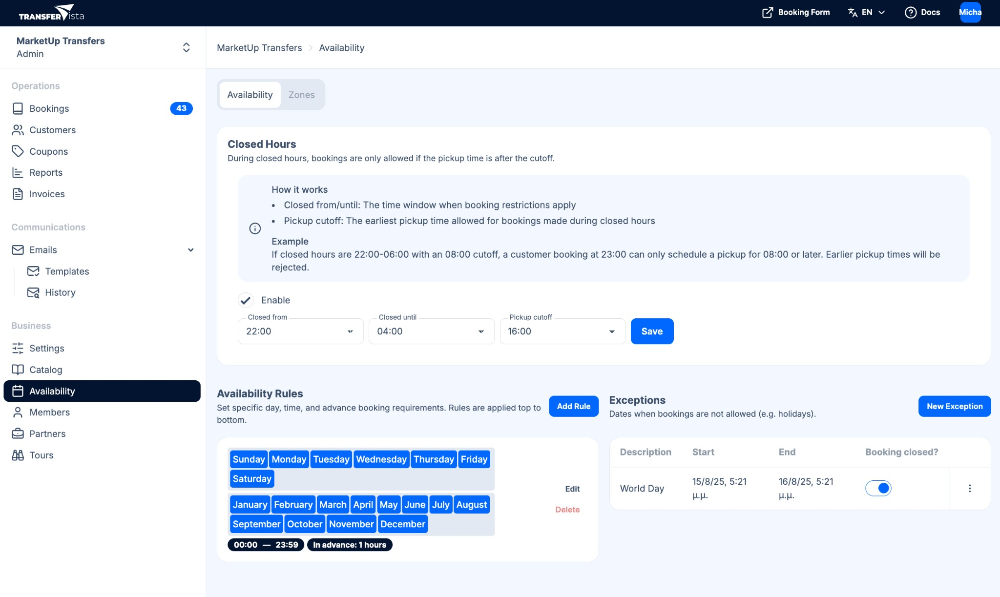

Availability settings in TransferVista control **when** and **where** customers can book transfers. This is separate from pricing: [Catalog > Areas](/docs/en/catalog/02-areas) define pricing zones; **Availability** defines where your service operates and which rules apply (e.g. hours, dates).

:::tip
Availability Zones (where you operate) are separate from Catalog Areas (pricing zones). See [Catalog > Areas](/docs/en/catalog/02-areas) for pricing.
:::

## What availability affects

- **Where** – [Availability Zones](/docs/en/availability/02-zones) define the geographic areas in which you accept bookings (e.g. Athens, airport corridor).
- **When** – [Rules & Scheduling](/docs/en/availability/01-rules-scheduling) let you set operating hours, closed hours, advance-booking margins, and unavailable dates (e.g. holidays).

If a customer tries to book outside these zones or outside your rules, they will see that the service is not available for that request.

The booking form evaluates availability in two steps: first it checks that pickup and drop-off fall within your [Availability Zones](/docs/en/availability/02-zones); then it applies your [Rules & Scheduling](/docs/en/availability/01-rules-scheduling) (operating hours, closed hours, advance-booking margin, and date exceptions) to determine which times are offered.

## How it works with the booking form

The public [booking form](/docs/en/booking-form/01-overview) uses your availability configuration to:

- Restrict pickup and drop-off to your availability zones
- Only offer times that fall within your rules and outside closed hours
- Block unavailable dates

In the admin panel, **Availability** is under **Business** in the sidebar. It has two tabs: **Availability** (closed hours, rules, exceptions) and **Zones** (geographic zones).

## Next steps

- [Availability Zones](/docs/en/availability/02-zones) - Define where your service operates
- [Rules & Scheduling](/docs/en/availability/01-rules-scheduling) - Set hours, closed periods, and date exceptions
