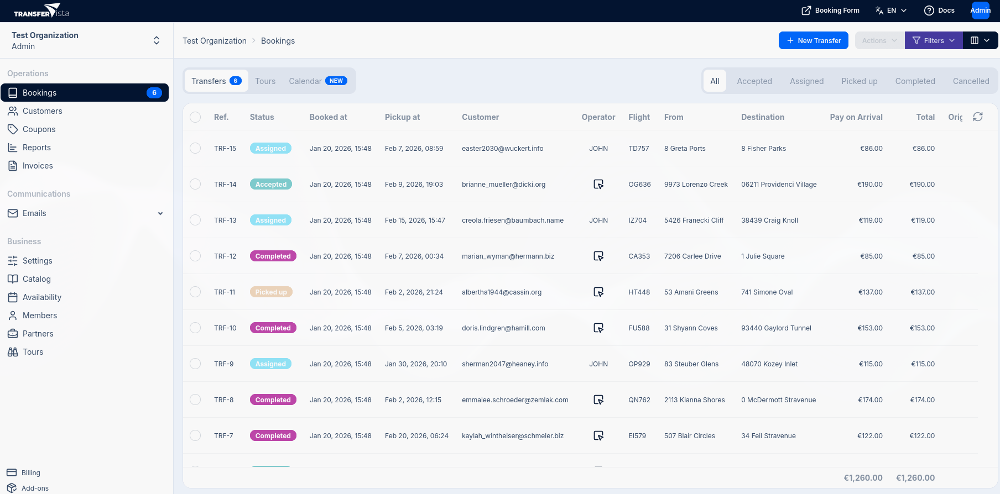

import { Badge } from '@astrojs/starlight/components';

## Introduction

The Bookings page is your central hub for managing all your bookings. From here, you can view, filter,
sort, and take action on bookings.

To access the Bookings page, click **Bookings** in the sidebar under the Operations section.

## Tabs

The Bookings page has three main tabs:

| Tab | Description |
|-----|-------------|
| **Transfers** | View and manage transfer bookings |
| **Tours** <Badge text="Add-on" variant="tip" /> | View and manage tour bookings |
| **Calendar** | Visual calendar view of all bookings by date and time |

A badge on the Transfers tab shows the count of active (non-completed, non-cancelled) bookings.

## Bookings Table

The bookings table displays all bookings in a table format. Some important columns are:

| Column | Description |
|--------|-------------|
| **Ref.** | The booking reference number |
| **Status** | Current booking status |
| **Booked at** | Date and time when the booking was created |
| **Pickup at** | Scheduled pickup date and time |
| **Customer** | Customer email address |
| **Operator** | Assigned driver/operator, or an **Assign** button if unassigned |
| **Flight** | Flight number (with integrated flight tracking) |
| **Ferry** | Ferry details (when applicable) |
| **Pay on Arrival** | Amount to be collected from the customer |
| **Total** | Total booking amount |
| **Origin** | Where the booking came from (Website, Partner name, etc.) |

## Status Filters

Use the status filter buttons to quickly filter bookings by their current status:

| Status | Description |
|--------|-------------|
| **All** | Show all bookings regardless of status |
| **Accepted** | Bookings that have been received but not yet assigned to a driver |
| **Assigned** | Bookings with an assigned driver, awaiting pickup |
| **Picked up** | Transfers currently in progress (customer has been collected) |
| **Completed** | Successfully completed transfers |
| **Cancelled** | Cancelled bookings |

## Advanced Filters

For more detailed filtering, click the **Filters** button in the toolbar. You can add multiple filter conditions.
Click **+ Add filter** to add filter conditions, then click **Apply filters** to update the table.

## Column Visibility

Click the **Toggle columns** button to show or hide specific columns. This is useful for focusing on the information most relevant to your workflow.

All columns are shown by default. Click a column name to toggle its visibility.

## Bulk Actions

Select multiple bookings using the checkboxes, then use the **Actions** dropdown to perform bulk operations on selected bookings.

## Creating New Bookings

Click the **New Transfer** button in the top-right corner to manually create a new transfer booking. For tours, switch to the Tours tab and click **New Tour**.

## Related Pages

- [Assigning Operators](/docs/en/bookings/03-assigning-operators) - Learn about driver assignment
- [Calendar View](/docs/en/bookings/05-calendar) - Navigate bookings visually
- [Status Workflow](/docs/en/bookings/06-status-workflow) - Understand booking lifecycle
- [Payments](/docs/en/bookings/04-payments) - Payment methods, deposits, and tracking
