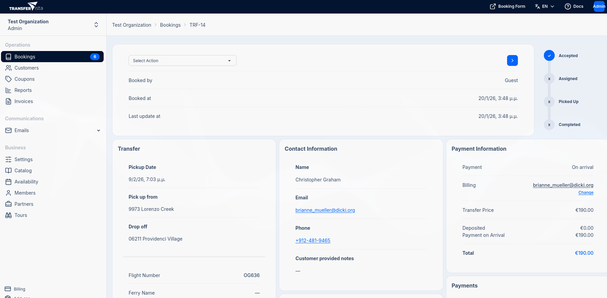

## Introduction

The Booking Details page provides a comprehensive view of an individual transfer or tour booking.
From here, you can view all booking information, manage the booking status, assign operators,
handle payments, add extras, and communicate with the customer.

The Booking Details page is organized into several sections:

- **Booking details** - Route and journey details
- **Contact Information** - Customer details
- **Operator** - Assignment and vehicle
- **Payment Information** - Pricing and billing
- **Payments** - Payment records and deposits
- **Extras** - Additional services
- **Messages** - Customer communication

## Header Section

The header displays miscellaneous booking information and status workflow.

| Field | Description |
|-------|-------------|
| **Select Action** | Dropdown to change booking status |
| **Booked by** | Who created the booking (Guest or user) |
| **Booked at** | Date and time the booking was created |
| **Last update at** | Date and time of the most recent change |

### Status Workflow

The right side of the header shows the booking's progress through the status workflow:

- **Accepted** - Booking has been received and confirmed
- **Assigned** - An operator/driver has been assigned
- **Picked Up** - Customer has been collected
- **Completed** - Transfer has been finished

A checkmark indicates a completed stage, while an "x" indicates a pending stage.

### Changing Status

To change the booking status:

1. Click the **Select Action** dropdown
2. Choose the desired status:
   - Set status to Pending Payment
   - Set status to Accepted
   - Set status to Completed
   - Set status to Cancelled
3. Click the **Apply** button (arrow icon)

## Transfer Section

This section displays all journey-related information:

| Field | Description |
|-------|-------------|
| **Pickup Date** | Scheduled date and time for pickup |
| **Pick up from** | Pickup location address |
| **Drop off** | Destination address |
| **Flight Number** | Customer's flight number (if provided) |
| **Ferry Name** | Ferry information (if applicable) |
| **Distance** | Calculated route distance in kilometers |
| **Est. Duration** | Estimated journey time |
| **Passengers** | Number of passengers |
| **Luggage** | Number of luggage pieces |

Click the **Edit** button to modify transfer details.

### Flight Tracking

When a flight number is provided, TransferVista can track the flight status. This helps you:

- Monitor for delays
- Adjust pickup times accordingly
- Keep customers informed

## Operator Section

This section shows driver assignment information:

| Field | Description |
|-------|-------------|
| **Operator** | Assigned driver's or partner's name (empty if unassigned) |
| **Vehicle** | Vehicle type for this booking |
| **Commission** | Operator's commission amount |

If no operator is assigned, click the **Assign** button to assign a driver. See
[Assigning Operators](/docs/en/bookings/03-assigning-operators) for more details.

## Payment Information Section

This section displays pricing and billing details:

| Field | Description |
|-------|-------------|
| **Payment** | Payment method (On arrival, Online, etc.) |
| **Billing** | Customer's billing email (linked to customer profile) |
| **Transfer Price** | Base price for the transfer |
| **Deposited** | Amount already paid as deposit |
| **Payment on Arrival** | Amount to be collected at pickup |
| **Total** | Total booking amount |

## Payments Section

This section shows all payment transactions for the booking:

- List of recorded payments with amounts and dates
- **Add Offline Deposit** button to record cash or manual payments
- **Send Payment Link** button to email a payment link to the customer

### Recording Offline Payments

If a customer pays via cash, bank transfer, or other offline method:

1. Click **Add Offline Deposit**
2. Enter the payment amount
3. Add any notes about the payment
4. Save the payment record

### Payment Link

If the booking is unpaid, you can send a payment link to the customer.
The payment can be partial or full. You must have [online payments enabled](/docs/en/settings/02-bookings)
to use this feature.

## Extras Section

Additional services booked with the transfer:

- List of extras (child seats, meet & greet, etc.) with prices
- **Add Extra** button to add additional services

### Adding Extras

To add an extra to the booking:

1. Click **Add Extra**
2. Select the extra service from the list
3. Confirm the addition

The booking total will be updated automatically.

## Messages to Customer Section

This section allows you to communicate directly with the customer:

- View history of messages sent to the customer
- **Send Message** button to compose a new message

### Sending Messages

To send a message to the customer:

1. Click **Send Message**
2. Compose your message
3. Send the message

Messages are sent to the customer's email address.

## Related Pages

- [Assigning Operators](/docs/en/bookings/03-assigning-operators) - Learn about driver assignment
- [Status Workflow](/docs/en/bookings/06-status-workflow) - Understanding booking lifecycle
- [Payments](/docs/en/bookings/04-payments) - Payment handling in detail
