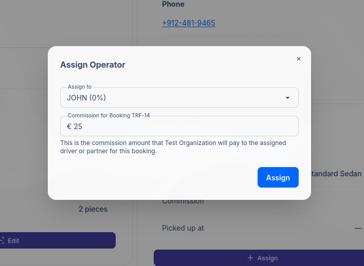
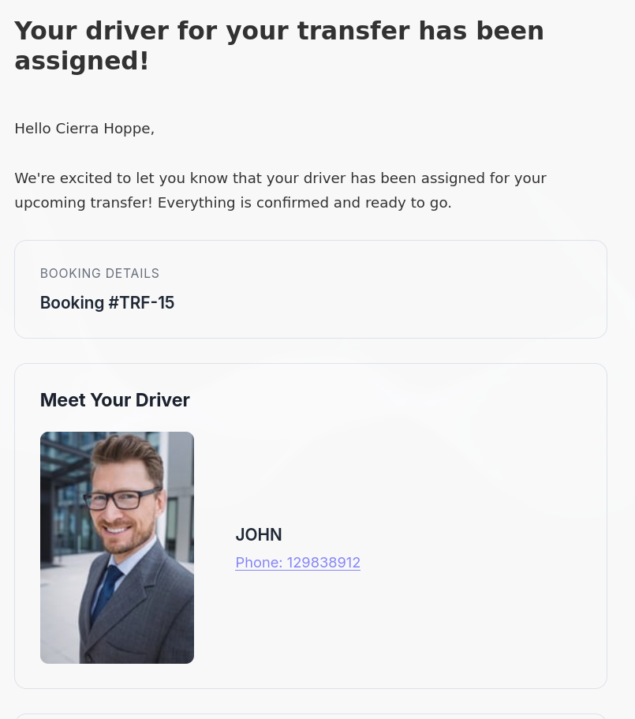

import { Aside } from '@astrojs/starlight/components';

## Introduction

Assigning an operator (driver or partner) to a booking is a key step in the booking workflow.
Once a booking is accepted, you can assign a driver or partner operator to fulfill the transfer.
The assigned operator receives notifications about their assignment and can view all relevant booking details.

Currently, you can assign an operator in three ways:

1. **From the bookings table** - Using bulk actions for multiple bookings, or by clicking the Assign
   button in the Operator column for single bookings
2. **From the booking details page** - Using the Assign button
3. **From the calendar view** - Clicking on a booking event

## Assigning an Operator

Regardless of which method you use, the assignment process opens the same dialog:

| Field | Description |
|-------|-------------|
| **Assign to** | The operator to assign. Shows the commission percentage, e.g. "JOHN (15%)" |
| **Commission** | The commission amount for this booking. This field is auto-calculated based on the operator's commission percentage and the booking total, but can be manually adjusted if needed. |

### Commission Calculation

When you select an operator from the dropdown, the commission field is automatically calculated based on:

- The operator's commission percentage (configured in their profile)
- The booking's total amount

You can manually adjust the commission amount if needed for specific bookings.

<Aside>
    The commission is the amount your organization will pay to the assigned driver or partner for fulfilling this booking.
    It is important to fill this field accurately, as it affects reporting.
    [Read more about reports](/docs/en/reports/01-generating-reports).
</Aside>

## Notifications

When a booking is assigned, email notifications are sent to both the customer and the operator:

| Recipient | Email |
|-----------|-------|
| **Customer** | Notified that a driver has been assigned to their booking |
| **Operator** | Receives assignment details with booking information |

<Aside title="Important" type="caution">
    Email notifications must be enabled in your email template settings for recipients to receive them.
    See [Email Templates](/docs/en/communications/01-email-templates) on how to manage notification settings.
</Aside>

## FAQs

### When Can You Assign?

Operators can only be assigned to bookings in the **Accepted** status.

### I didn't receive an assignment email. Why?

Make sure that the assignment notification email template is enabled in your settings.

### What can the customer see after assignment?

Once assigned, the customer will see the operator's name, photo and contact details in their booking
confirmation email.

## Related Pages

- [Booking Details](/docs/en/bookings/02-booking-details) - View and manage individual bookings
- [Calendar View](/docs/en/bookings/05-calendar) - Visual booking management
- [Status Workflow](/docs/en/bookings/06-status-workflow) - Understanding booking lifecycle
- [Drivers](/docs/en/team/02-drivers) - Managing driver profiles and commissions
- [Email Templates](/docs/en/communications/01-email-templates) - Configure notification emails
