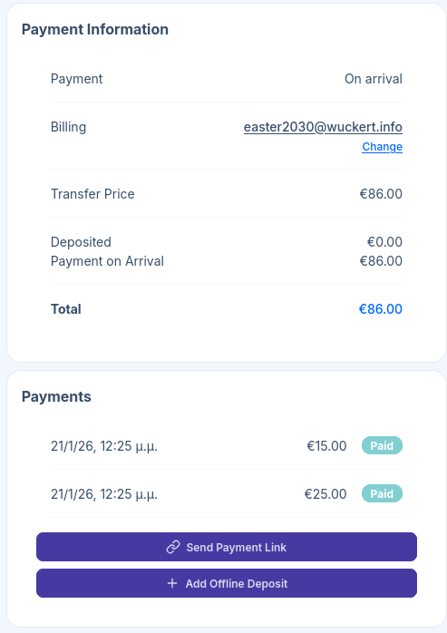
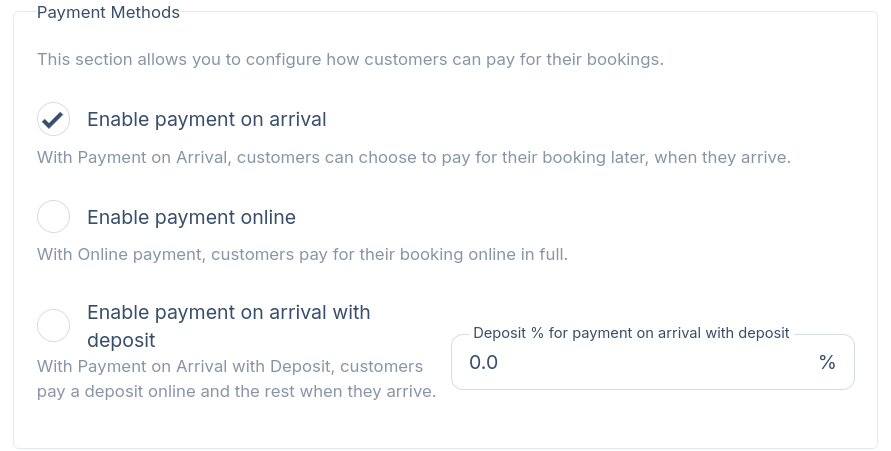
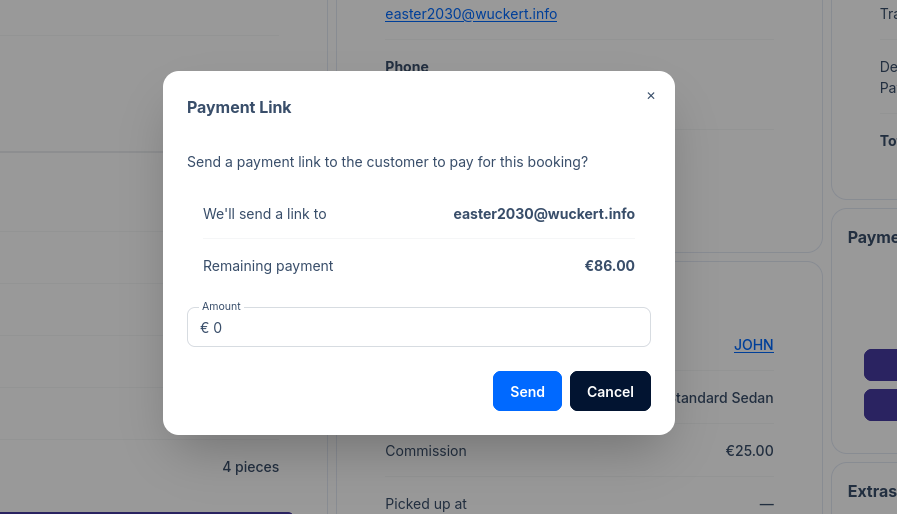

import { Aside } from '@astrojs/starlight/components';

## Introduction

TransferVista enables easy and flexible tracking of payment records for your bookings. Payments
can be made online, partially as deposits, or fully on arrival to the driver.

A booking is considered **fully paid** when the sum of all payment transactions equals the total
booking amount. If payments don't cover the full amount, **the remaining balance is marked as "Pay on Arrival"**
which means the customer will pay the driver directly (with cash, card, or other methods).

## Payment Methods

TransferVista supports three payment methods that you can enable in **Settings > Bookings**.

| Method | Description |
|--------|-------------|
| **Pay on Arrival** | Customer pays the full amount when they arrive (to the driver). No online payment required. |
| **Online Payment** | Customer pays the full amount online during booking. |
| **Pay on Arrival with Deposit** | Customer pays a percentage upfront online, with the remaining balance due on arrival. |

<Aside type="tip">
    You can enable any combination of these methods to give customers flexibility. It might be
    worthwhile checking them once in a while during on or off seasons.
</Aside>

<Aside type="caution">
    Online payments and payments on arrival with deposits require a connected Stripe account to process
    payments securely. [Learn how to connect Stripe](/docs/en/settings/06-integrations)
</Aside>

### Configuring Payment Methods

1. Go to **Settings** in the sidebar
2. Click the **Bookings** tab
3. Scroll to the **Payment Methods** section
4. Enable the methods you want to offer:
   - Check **Enable payment on arrival** for cash/card payments to drivers
   - Check **Enable payment online** for full online payments
   - Check **Enable payment on arrival with deposit** for partial deposits
5. If using deposits, set the **Deposit %** (e.g., 20% means customers pay 20% online, 80% on arrival)
6. Click **Save**

## Understanding Payment Status

Each booking displays payment information in two sections on the booking details page: Payment Information
and Payments.

| Field | Description |
|-------|-------------|
| **Payment** | The payment method selected (e.g., "On arrival", "Online", "Deposit") |
| **Billing** | The customer's billing email, linked to their customer record |
| **Transfer Price** | The base price for the transfer |
| **Deposited** | Amount already paid online |
| **Payment on Arrival** | Remaining amount due on arrival |
| **Total** | Full booking amount |

## Managing Payments

TransferVista provides very flexible tools to handle various payment scenarios. It is also important
to keep payment records accurate for reporting and driver instructions.

### Online Payments

When a customer pays online during booking, the payment is automatically recorded and appears in the
Payments section. The "Pay on Arrival" amounts are updated accordingly, and the booking is considered
fully paid.

### Send Payment Link

Use this to request online payment from a customer after the booking is created.

1. Open the booking details page
2. Click **Send Payment Link** in the Payments section
3. Enter the amount to request (can be partial or full remaining balance)
4. Click **Send**

<Aside type="tip">
    You may accept deposits or on arrival payments for all your online bookings. Then, you can
    use the Send Payment Link feature to request deposits or full payments after communicating
    with the customer knowing that the booking is confirmed.
</Aside>

### Add Offline Deposit

Use this to record payments received outside of the online system (e.g., bank transfers, cash deposits, checks).

1. Open the booking details page
2. Click **Add Offline Deposit** in the Payments section
3. Enter the amount received
4. Click **Add**

The payment is immediately recorded and the "Deposited" and "Payment on Arrival" amounts update accordingly.

<Aside type="tip">
    Use offline deposits to track bank transfers or cash payments received before the transfer date.
    This keeps your payment records accurate and shows drivers what's still owed on arrival.
</Aside>

## Common Payment Workflows

### Full Online Payment

1. Customer books and pays online during checkout
2. Booking status shows "Deposited: €X" (full amount)
3. "Payment on Arrival" shows €0.00
4. Driver doesn't need to collect any payment

### Deposit with Balance on Arrival

1. Customer pays deposit (e.g., 20%) during booking
2. Booking shows "Deposited: €X" (deposit amount)
3. "Payment on Arrival" shows remaining balance
4. Driver collects the remaining amount on arrival

### Pay on Arrival Only

1. Customer books without online payment
2. "Deposited" shows €0.00
3. "Payment on Arrival" shows full amount
4. Driver collects full payment on arrival

### Manual Payment Collection

1. Customer makes a bank transfer
2. Staff records it using **Add Offline Deposit**
3. Payment amounts update automatically
4. Driver sees reduced (or zero) amount to collect

## Related Pages

- [Booking Details](/docs/en/bookings/02-booking-details) - Full booking management
- [Integrations](/docs/en/settings/integrations) - Connect Stripe for online payments
