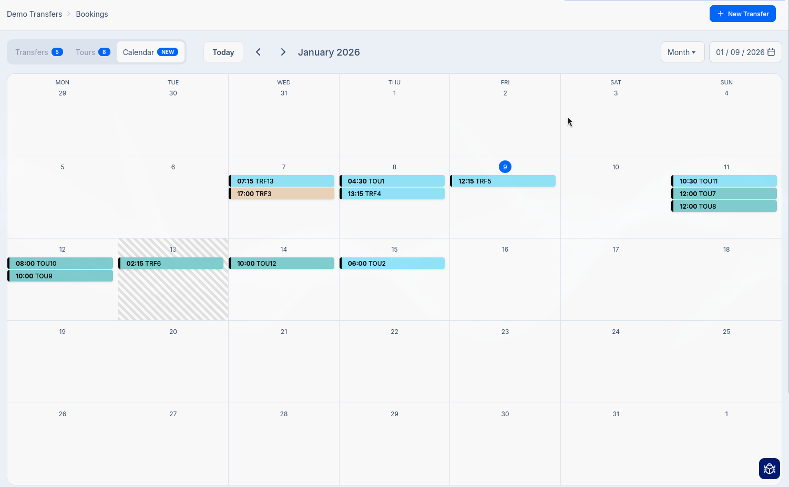
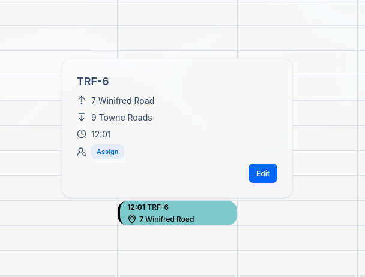

## Introduction

The Calendar provides a visual way to view and manage your bookings by pickup date and time.
Instead of scrolling through a table, you can see all your upcoming transfers at a glance, organized
by day, week, or month.

To access the Calendar, go to **Bookings** in the sidebar and click the **Calendar** tab.

## Calendar Views

The calendar offers three different views to help you visualize your schedule. Use the dropdown in
the top-right corner to switch between views.

| View | Description |
|------|-------------|
| **Week** | Shows 7 days with hourly time slots. Best for detailed daily scheduling. |
| **Month** | Shows the full month in a grid. Best for an overview of busy periods. |
| **Day** | Shows a single day with hourly time slots. Best for managing a busy day. |

Events are color coded based on their status. Learn more about [booking statuses](/docs/en/bookings/06-status-workflow).

## Navigation

### Moving Between Dates

Use the navigation controls in the toolbar to move through the calendar:

| Control | Action |
|---------|--------|
| **Previous** (left arrow) | Move to the previous week, month, or day |
| **Next** (right arrow) | Move to the next week, month, or day |
| **Today** | Jump back to the current date |

### Date Picker

Click the date display (e.g., "01/21/2026") to open a date picker. Select any date to jump directly
to that day, week, or month.

## Working with Bookings

You are able to view, create, and manage bookings directly from the calendar interface.

### Viewing Booking Details

Click on any booking in the calendar to see a quick summary popover

Click **Edit** to open the full [booking details page](/docs/en/bookings/02-booking-details).
You may also assign directly from the popover. This is useful when revewing your schedule.

### Creating New Bookings

You can create a new booking directly from the calendar by clicking on an empty time slot:

1. Click on an empty area in the calendar at your desired date and time
2. A "New Booking" placeholder appears with the message "Click again to confirm"
3. Click the placeholder to confirm
4. You'll be taken to the New Transfer form with the pickup date and time pre-filled

This workflow is faster than manually entering the date and time when you already know exactly when
the transfer should be scheduled.

## Rescheduling Bookings

You can reschedule bookings by dragging and dropping events to a new date or time. Simply click and
hold on a booking event, drag it to the desired time slot, and release. The booking's pickup time
will be updated automatically.

Alternatively, click on a booking and select **Edit** to open the booking details page where you can modify the pickup date and time manually.

## Tips for Using the Calendar

- **Check your week ahead**: Use the Week view at the start of each week to review upcoming transfers and ensure all bookings have operators assigned.
- **Spot scheduling conflicts**: The visual layout makes it easy to see if you have multiple bookings at overlapping times.
- **Quick assignments**: Use the calendar's inline assignment feature to quickly assign drivers while reviewing your schedule.
- **Plan around busy periods**: The Month view helps identify your busiest days so you can plan resources accordingly.

## Related Pages

- [Bookings Overview](/docs/en/bookings/01-overview) - Table view of all bookings
- [Booking Details](/docs/en/bookings/02-booking-details) - Managing individual bookings
- [Assigning Operators](/docs/en/bookings/03-assigning-operators) - Driver assignment workflow
- [Status Workflow](/docs/en/bookings/06-status-workflow) - Understanding booking lifecycle
