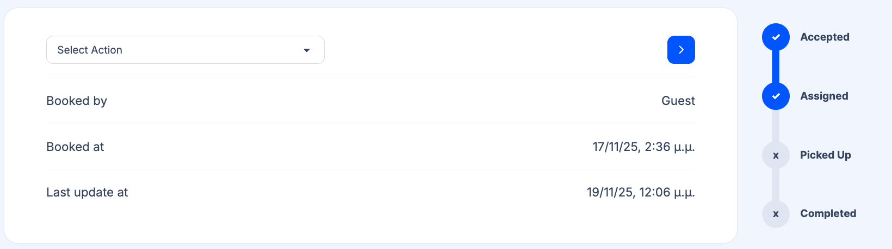

Every transfer booking in TransferVista moves through a clear status workflow. Understanding each status and when it changes helps you and your drivers keep operations smooth and customers informed.

## Status definitions

| Status | Description |
|--------|-------------|
| **Pending Payment** | Awaiting customer payment (e.g. deposit or full online payment). Applies when online payment or deposit is enabled and not yet completed. |
| **Accepted** | Booking has been received and confirmed. Ready for assignment to a driver. |
| **Assigned** | A driver or operator has been allocated to the booking. The driver can see it in their assignments. |
| **Picked up** | Customer has been collected. The transfer is in progress. |
| **Completed** | Journey is finished. Payment on arrival (if any) has been collected. |
| **Cancelled** | Booking has been voided. No transfer will take place. |

You can filter bookings by these statuses on the [Bookings](/docs/en/bookings/01-overview) page.

## How status changes

- **Automatic:** Some statuses are set by the system (e.g. Accepted when a booking is created, Pending Payment when online payment is required).
- **Manual:** You or your drivers change status via the **Select Action** dropdown on the [Booking Details](/docs/en/bookings/02-booking-details) page. Drivers typically mark **Picked up** when they collect the customer and **Completed** when the journey ends.

Only valid transitions are offered (e.g. you cannot mark a booking Completed without it first being Picked up).

:::caution
Only valid status transitions appear in the Select Action dropdown (e.g. you cannot set Completed without first Picked up).
:::

## Notifications

When status changes, TransferVista can send email notifications to customers, managers, and drivers (e.g. “Driver assigned”, “Transfer completed”). You can turn these on or off in [Communications > Email Templates](/docs/en/communications/01-email-templates).

## Related pages

- [Bookings Overview](/docs/en/bookings/01-overview) - Filter and list bookings by status
- [Booking Details](/docs/en/bookings/02-booking-details) - Change status via Select Action
- [Assigning Operators](/docs/en/bookings/03-assigning-operators) - Assign a driver (Accepted → Assigned)
