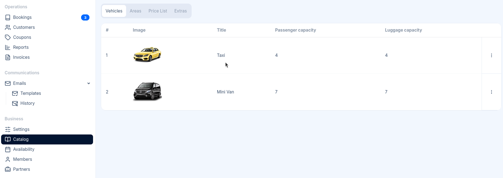

import { Steps } from '@astrojs/starlight/components';

To access Vehicles, go to **Catalog** in the sidebar.

Vehicles represent the **categories** of transport you offer to customers. They are directly related
to pricing.

:::note
Vehicle configuration is required. You must create at least one vehicle to enable bookings.
:::

## Adding a New Vehicle

<Steps>

1. Click **New Vehicle** in the top right corner

2. Fill in the vehicle details (see Reference below)

3. Click **Save**

</Steps>

The vehicle will immediately appear in your list. You should configure [pricing](/docs/en/catalog/03-price-lists) for the vehicle next.

## Reference

| Field | Description |
|-------|-------------|
| **Title** | The vehicle name displayed to customers (e.g., "Standard Sedan", "Luxury Van", "Minibus"). |
| **Image** | A photo of the vehicle. Drag and drop an image or click to browse. Maximum file size: 8MB. |
| **Description** | Optional details about the vehicle shown to customers. Supports rich text formatting (bold, italic, lists, links). Maximum 2000 characters. |
| **Passenger capacity** | Maximum number of passengers the vehicle can accommodate. Customers cannot select this vehicle if their party size exceeds this number. |
| **Luggage capacity** | Maximum number of luggage pieces the vehicle can carry. Helps customers choose an appropriate vehicle for their luggage needs. |

## Tips

### Vehicle Images

- Use high-quality photos that clearly show the vehicle
- Consistent image styles across your fleet create a professional appearance

### Naming Vehicles

Choose clear, descriptive names that help customers understand what to expect:

- **Good**: "Standard Sedan", "Minivan", "Mercedes S-Class"
- **Avoid**: "Car 1", "Vehicle A", "8-seat Minivan", or overly technical names

### Capacity Settings

Set capacities based on comfortable travel with luggage. Vehicles are disabled for selection if the
customer's party size or luggage exceeds the set limits.
