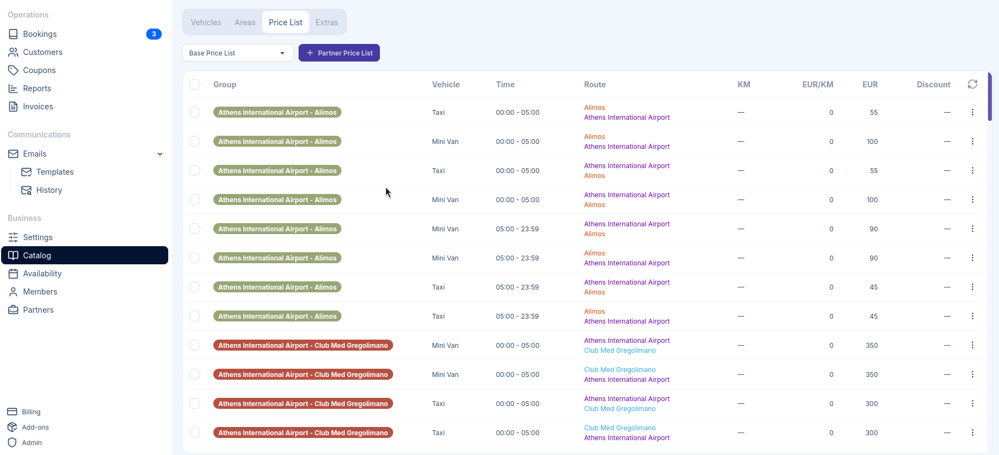

import { Steps, Aside } from '@astrojs/starlight/components';

To access Price Lists, go to **Catalog** in the sidebar and select the **Price List** tab.

Price Lists define how much customers pay for transfers. TransferVista's pricing system is highly flexible, allowing you to set prices by route, by distance (KM), by vehicle type, and by time of day. You can combine these dimensions to create sophisticated pricing rules.

:::note
Price List configuration is required. Every vehicle must have at least one matching pricing rule, or it will not appear on the booking form.
:::

## Understanding Price Lists

The Price List is a table of pricing rules. Each rule defines a price for a specific combination of:

| Dimension | Description |
|-----------|-------------|
| **Group** | A label to organize related pricing rules |
| **Vehicle** | Which vehicle type this price applies to |
| **Time** | The time range during which this price applies (e.g., 00:00 - 23:59 for all day) |
| **Route (optional)** | The origin and destination Areas |
| **KM** | Distance range for KM-based pricing (e.g., 0-10 km, 10-20 km) |
| **EUR/KM** | Rate per kilometer for distance-based calculations |
| **EUR** | Flat rate amount |
| **Discount** | Optional discount percentage applied to this rule |

### Pricing Approaches

#### Pricing by Route with Flat Rate

Use route-based pricing when you have fixed prices between specific locations. Can be used for
airport transfers or common routes to airports.

**Example**: Airport → City Center = €45

#### Pricing by Distance (KM)

Use distance-based pricing when prices should scale with trip length. Can be used for transfers where
areas are not predefined.

**Example**: €2.50 per km + €10 base fee

#### Pricing by Route with Flat Rate + By Distance

Use this hybrid approach when you want a base price for a route plus variable pricing based on distance.
Can be used for longer transfers where distance affects cost.

**Example**: Athens Airport → Thessaloniki City = €50 base + €1.50/km

## Adding Prices by Route

<video controls autoplay loop muted>
    <source src="/docs/screencasts/price-list-by-route.mp4" type="video/mp4" />
</video>

<Steps>

1. Click **New Entries** in the top right corner and then **Add Prices by Route**

1. Fill in the pricing details:
   - **Group**: Label for organizing rules
   - **Vehicle**: Select the vehicle type
   - **From/To Time**: Set the time range (e.g., 00:00 to 23:59 for all day)
   - **Origin** and **Destination**: The 2 Areas defining this route
   - **Reverse**: Check this to automatically create the return route at the same price

1. Choose a pricing type:
   - **Flat Rate**: Enter a fixed price for this route
   - **KM Ranges**: Set variable pricing based on distance

1. Click **Add Route** to add more origin/destination pairs with the same settings

1. Click **Save**

</Steps>

### Using KM Ranges with Routes

When you select **KM Ranges** instead of Flat Rate, you can define tiered pricing based on the actual
distance of the route:

| Field | Description |
|-------|-------------|
| **KM Start** | The starting distance for this tier (e.g., 0) |
| **KM End** | The ending distance for this tier (e.g., 10) |
| **KM Rate** | Price per kilometer within this range |
| **Flat Rate** | Base price added to the per-km calculation |

Click **Add KM Range** to create multiple tiers with different rates.

## Adding Prices by KM

<video controls autoplay loop muted>
    <source src="/docs/screencasts/price-list-by-km.mp4" type="video/mp4" />
</video>

For pure distance-based pricing without specific routes:

<Steps>

1. Click **New Entries** in the top right corner

1. Select **Add Prices by KM**

1. Fill in the pricing details:
   - **Group**: Optional label for organizing rules
   - **Vehicle**: Select the vehicle type
   - **From/To Time**: Set the time range

1. Set the distance tier:
   - **KM Start**: Starting distance (e.g., 0)
   - **KM End**: Ending distance (e.g., 10)
   - **KM Rate**: Price per kilometer
   - **Flat Rate**: Base price added to the calculation

1. Click **Add prices by KM** to add more distance tiers

1. Click **Save**

</Steps>

## Time-Based Pricing

Both pricing methods support time ranges, allowing you to charge different rates based on when the transfer occurs:

**Example scenarios**:
- **Day rates** (06:00 - 22:00): Standard pricing
- **Night rates** (22:00 - 06:00): Premium pricing with 20% markup
- **Peak hours** (07:00 - 09:00, 17:00 - 19:00): Higher rates during rush hour

Create separate pricing rules for each time period with different rates.

## Bulk Actions

You can perform bulk actions on multiple pricing rules at once. Some actions include deleting selected rules,
applying discounts, or changing prices.

<Steps>

1. Check the boxes next to the rules you want to change

1. Click the **Actions** button in the toolbar

1. Select the bulk action

</Steps>

### Filtering the Price List

Use the **Filters** button to narrow down the displayed rules.

- By vehicle type
- By time range
- By origin or destination Area
- By group

It can be helpful when bulk editing or reviewing specific segments of your pricing.

## Base vs Partner Price Lists

TransferVista supports multiple price lists:

### Base Price List

The default price list that applies to all direct bookings through your booking form. This is the standard pricing for customers booking directly with your company.

### Partner Price Lists

You can create separate price lists for [Booking Partners](/docs/en/partners/02-booking-partners)
who book transfers on behalf of their customers. Partner price lists allow you to:

- Offer wholesale or discounted rates to partners
- Set different pricing structures for different business relationships
- Maintain separate pricing from your public rates

To create a partner price list, click **Partner Price List** next to the price list dropdown. This
will copy the current base price list, which you can then modify for that partner.

## Vehicle Visibility on Booking Form

<Aside type="caution" title="Important: Vehicles require pricing rules">
A vehicle will only appear on the booking form if it has a matching pricing rule. If a customer selects a route and time that doesn't match any pricing rule for a vehicle, that vehicle will not be shown as an option.
</Aside>

This behavior ensures customers only see vehicles with valid pricing for their specific transfer request. If a vehicle isn't appearing on your booking form:

1. Check that pricing rules exist for that vehicle
2. Verify the time range covers the customer's pickup time
3. Confirm the route (origin and destination Areas) is covered
4. For KM-based pricing, ensure the distance falls within a defined range

## Pricing Examples

Below are some common pricing scenarios you can implement using TransferVista's pricing system.

### Flat Rate Airport Transfers

| Vehicle | Time | Route | EUR |
|---------|------|-------|-----|
| Sedan | 00:00 - 23:59 | Airport → City | €45 |
| Sedan | 00:00 - 23:59 | City → Airport | €45 |
| Van | 00:00 - 23:59 | Airport → City | €65 |
| Van | 00:00 - 23:59 | City → Airport | €65 |

### Day/Night Rate Differential

| Vehicle | Time | Route | EUR |
|---------|------|-------|-----|
| Sedan | 06:00 - 22:00 | Airport → City | €45 |
| Sedan | 22:00 - 06:00 | Airport → City | €55 |

### Distance-Based Pricing

| Vehicle | Time | KM | EUR/KM | EUR (base) |
|---------|------|------|--------|------------|
| Taxi | 00:00 - 23:59 | 0-100 | €1.50 | €5 |

A 25 km trip would cost: €5 base + (25 × €1.50) = €42.50

### Tiered Distance Pricing

| Vehicle | Time | KM | EUR/KM | EUR (base) |
|---------|------|------|--------|------------|
| Sedan | 00:00 - 23:59 | 0-20 | €2.00 | €10 |
| Sedan | 00:00 - 23:59 | 20-50 | €1.50 | €50 |
| Sedan | 00:00 - 23:59 | 50-100 | €1.00 | €95 |

**Examples**
- 15 km trip: €10 + (15 × €2.00) = €40
- 35 km trip: €50 + (35 × €1.50) = €102.50
- 75 km trip: €95 + (75 × €1.00) = €170

## Tips

### Organizing with Groups

Use the **Group** field to organize related pricing rules:
- "Sedan Day" for standard daytime rates
- "Night Premium" for after-hours pricing

Groups help you quickly identify and filter related rules.

:::tip
With price list groups is how we also apply commission rules to booking partners.
:::

### Route Coverage

Ensure you have pricing rules for both directions of common routes. Use the **Reverse** checkbox when creating route-based pricing to automatically create both directions.

### Testing Your Pricing

After setting up pricing rules, test your booking form:
1. Select different pickup and drop-off locations
2. Try various times throughout the day
3. Verify all vehicles appear when expected
4. Check that displayed prices match your rules
