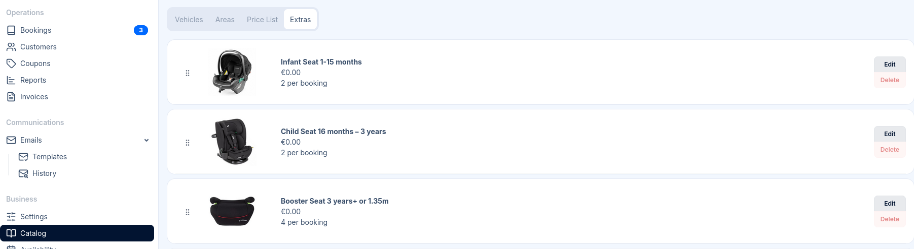
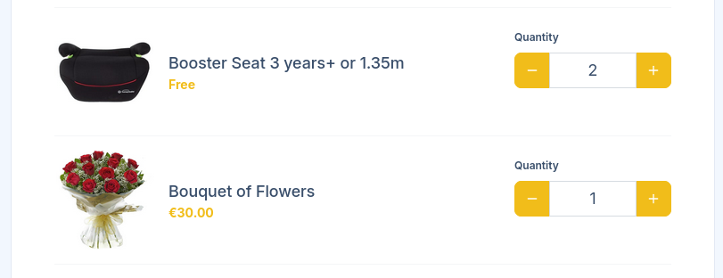

import { Steps } from '@astrojs/starlight/components';

To access Extras, go to **Catalog** in the sidebar and select the **Extras** tab.

Extras are optional add-on services that customers can include with their transfer booking. They allow you to offer additional services and generate extra revenue from each booking.

## Adding an Extra

<Steps>

1. Click **New Extra** in the top right corner (or **Add Extra** if you have no extras yet)

1. Fill in the extra details (see Reference below) and click **Save**

</Steps>

The extra will appear in your list and become available for customers to select on the booking form.

## Deleting an Extra

<Steps>

1. Find the extra in the list

1. Click **Delete** and confirm

</Steps>

:::note
Deleting an extra won't remove it from existing bookings that include this extra.
:::

## Reference

| Field | Description |
|-------|-------------|
| **Name** | The name of the extra as displayed to customers (e.g., "Child Seat", "Meet & Greet"). Keep it short and clear. |
| **Price** | The cost of this extra, added to the booking total. Enter the amount in your configured currency (e.g., "€ 10"). |
| **Max per booking** | The maximum quantity a customer can add per booking. Set to 1 for single items (like meet & greet), or higher for items customers might need multiples of (like child seats). |
| **Image** | An optional image representing the extra. Drag and drop an image or click to browse. Maximum file size: 8MB. |

## How Extras Appear to Customers

When customers complete a booking on your booking form, they see a list of available extras after
selecting their vehicle. Each extra displays the name, price, and a quantity selector.

Customers can add extras to their booking, and the total price updates automatically.

## Extras in Bookings

When a customer adds extras to their booking:

- The extras are listed in the booking details
- The extra costs are added to the booking total
- Drivers can see which extras are included in their assignment

## Tips

### Common Extra Examples

- **Child seat** - Baby or toddler car seats
- **Booster seat** - For older children
- **Meet & greet** - Driver meets passenger with a name sign
- **Champagne** - Bottle of champagne for celebrations

### Images

Adding images to extras helps customers understand what they're selecting:

- Use clear, simple images that represent the item
- Consistent image styles create a professional appearance
- Images are optional but recommended for visual extras like child seats
- Images appear as thumbnails next to their names, with a light or white background
