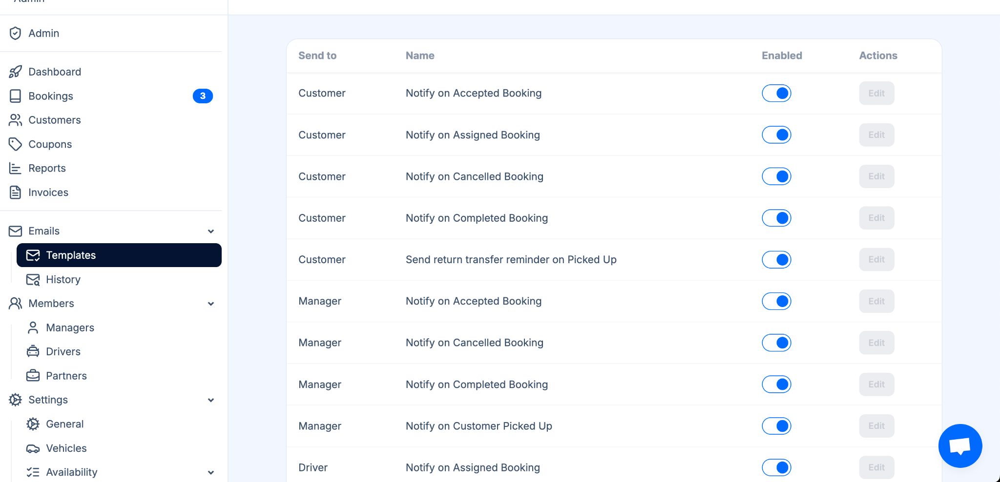

TransferVista provides a powerful and automated **Email Notification System** designed to keep customers, managers, and drivers informed throughout the entire booking lifecycle. The platform sends event-based emails for key actions such as booking acceptance, assignment, pickup, and cancellation. These notifications help ensure smooth operations, reduce miscommunication, and improve the overall customer experience.

In addition to operational updates, TransferVista also includes **automated upsell emails**, such as reminders for return transfers. These messages encourage customers to book their return journey, helping your company **increase revenue effortlessly**.

---

## Overview

The Email Notifications module allows administrators to enable or disable specific email templates for each type of user:

- **Customers**
- **Managers**
- **Drivers**

Each notification is triggered automatically when a related action occurs in the system. Templates can be fully customized to match your brand tone and communication needs.

---

## Customer Notifications

Customers can receive automated emails for:

- **Accepted Booking**  
  Sent when a booking is accepted by your team.

- **Assigned Booking**  
  Informs the customer that a driver or vehicle has been assigned.

- **Cancelled Booking**  
  Alerts the customer when their booking has been cancelled.

- **Completed Booking**  
  Sent when a transfer has been successfully completed.

- **Return Transfer Reminder (Upsell)**  
  A strategic email that reminds customers to book their return transfer.  
  This feature helps increase revenue by promoting an additional service at the right moment.

---

## Manager Notifications

Managers can receive emails to stay on top of operations:

- **Accepted Booking**
- **Cancelled Booking**
- **Completed Booking**
- **Customer Picked Up**

These notifications ensure managers remain informed and can react quickly when needed.

---

## Driver Notifications

Drivers can receive emails such as:

- **Assigned Booking**  
  Notifies the driver when a new job has been assigned to them.

These alerts help drivers prepare for upcoming trips and reduce coordination delays.

---

## Enabling & Editing Email Templates

In the **Admin Panel → Emails → Templates**, you can:

- Enable or disable each email type  
- Edit the content of every template  
- Customize branding, messaging, and formatting  
- Control which roles receive which notifications

This flexibility lets your team tailor communication exactly to your workflow and customer expectations.

---

## Business Benefits

- **Better customer experience** via real-time updates  
- **Reduced support workload** thanks to automated communication  
- **Increased revenue** through intelligent upsell emails (return transfer reminders)  
- **Improved internal coordination** for drivers and managers  
- **Higher operational efficiency** with automated triggers  

---

## Email History

The **Email History** section provides a complete log of all emails sent through the platform.  
From this view, administrators can easily check:

- Which emails were sent  
- The recipient of each email  
- The date and time of delivery  
- The delivery status (e.g., sent, failed)

By clicking on any email in the list, a **full preview of its content** is displayed.  
This allows administrators to see the exact message the user received, verify that the content is correct, and troubleshoot any communication issues.

This feature provides transparency, simplifies monitoring, and significantly helps in resolving any email-related problems.

## Summary

The Email Notifications feature is a core part of TransferVista’s automation engine. It keeps everyone informed, minimizes manual work, and opens new revenue opportunities through strategically timed upsell communication. With complete control over templates and triggers, your business can deliver fast, consistent, and branded customer communication at every stage of the journey.
