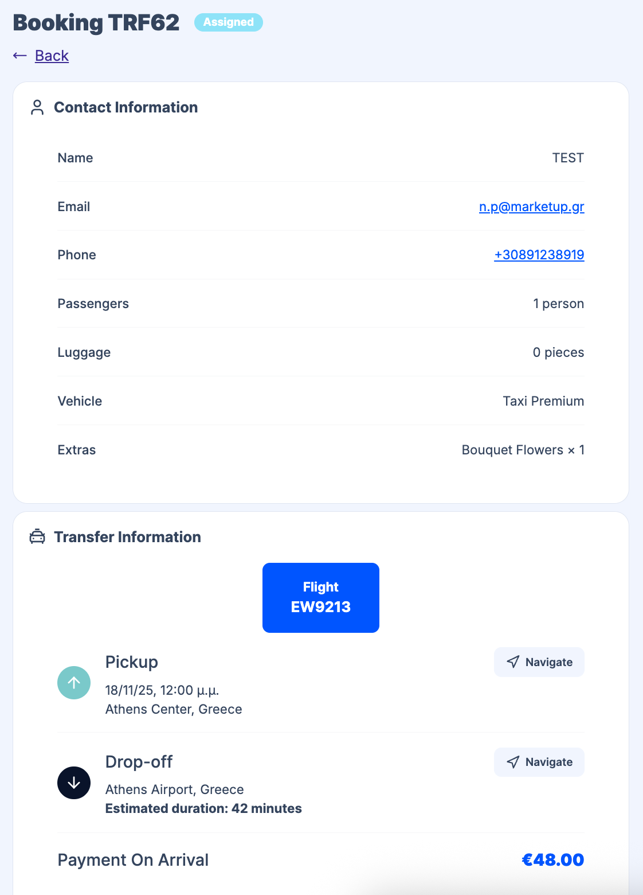

Drivers see their assignments on the [Dashboard](/docs/en/drivers/01-overview) under **Transfers**, **Tours**, and **Previous Assignments**. Tapping or clicking an assignment opens the full transfer details.

## Assignments list (Dashboard)

Assignments are grouped by time: **Transfers** shows current and upcoming assignments (today and future); **Previous Assignments** shows completed transfers (past). **Tours** shows current tour assignments when applicable.

On the Dashboard, each assignment in **Transfers** and **Previous Assignments** shows at a glance:

- **Booking reference** (e.g. TRF71) and **status** (e.g. Assigned, Completed)
- **Customer name**
- **Pickup location**
- **Pickup date and time**
- **Flight or ferry** (when provided for airport/port pickups)

Drivers tap or click a row to open the full details.

## Assignment detail view

When drivers open an assignment, they see:

- **Contact Information** – Customer name, email, phone, number of passengers and luggage, vehicle assigned, extras (if any)
- **Transfer Information** – Pickup date and time, pickup address, drop-off address, estimated duration. Each location has a **Navigate** link that opens the route in Google Maps so drivers can plan the journey and navigate.
- **Customer Notes** – Special instructions or notes (or "No notes provided" when empty)
- **Payment** – When your [Permissions](/docs/en/settings/05-permissions) allow it, drivers see the payment method and amount (e.g. Payment on Arrival €687.60). Otherwise this is hidden.
- **Actions** – Buttons to update status: **Picked Up** (when they collect the customer) and **Completed** (when they drop off). See [Managing Bookings](/docs/en/drivers/03-managing-bookings).

Drivers can also open **Voucher** from this screen.

## Viewing the route

Use the **Navigate** links next to the pickup and drop-off addresses to open the route in Google Maps. Drivers can start turn-by-turn navigation from there.

:::note
The **Navigate** link opens the route in Google Maps for turn-by-turn directions.
:::

## Price and commission visibility

Whether drivers see the booking price or their commission depends on your [Permissions](/docs/en/settings/05-permissions) settings. You can hide these so drivers only see operational details.

## Related pages

- [Driver Experience Overview](/docs/en/drivers/01-overview)
- [Managing Bookings](/docs/en/drivers/03-managing-bookings) - Updating status (Picked up, Completed)
