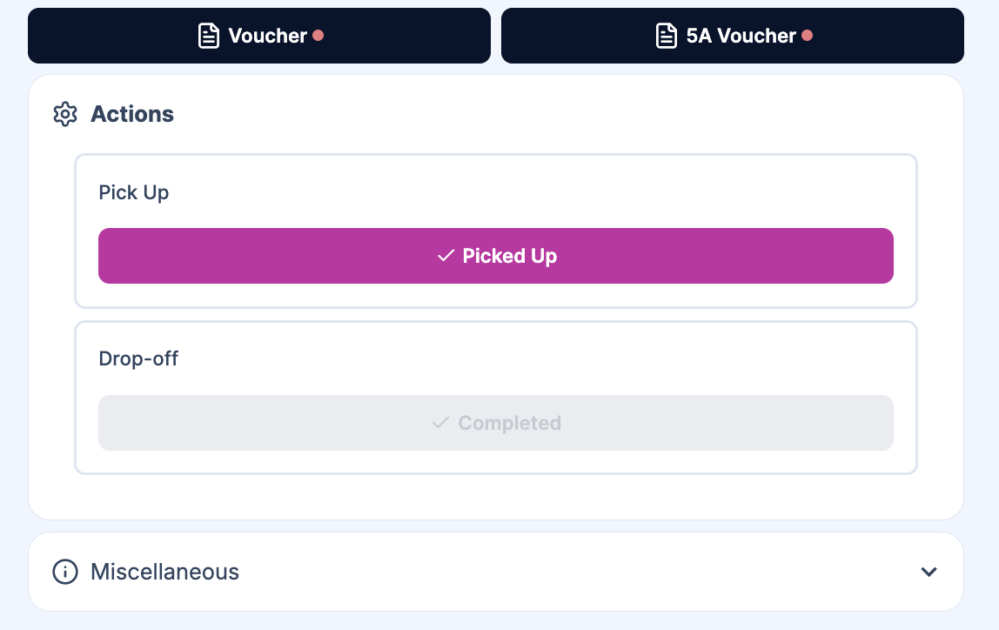

Drivers update booking status from the [assignment detail view](/docs/en/drivers/02-viewing-assignments#assignment-detail-view). At the bottom of the screen, the **Actions** section has two buttons: **Picked Up** and **Completed**.

## Updating status

Two status changes are done by the driver:

1. **Picked Up** – Tap this when the customer has been collected and the journey has started.
2. **Completed** – Tap this when the customer has been dropped off and the transfer is finished.

The **Completed** button is only available after the booking has been marked **Picked Up**. You may see a short confirmation (e.g. "Mark as Picked Up?") before the status is updated.

:::tip
**Completed** is only available after the driver has marked the booking **Picked up**.
:::

## After the status change

- When you mark a booking **Completed**, it moves to **Previous Assignments** on your [Dashboard](/docs/en/drivers/01-overview).
- TransferVista can send email notifications to the customer and/or manager (e.g. "Driver has picked you up", "Transfer completed"), depending on your [Email Templates](/docs/en/communications/01-email-templates) settings.

## Viewing completed assignments

Completed transfers appear in the **Previous Assignments** section on the Dashboard. Use this to review what you have done and for record-keeping.

## Related pages

- [Viewing Assignments](/docs/en/drivers/02-viewing-assignments) - Open an assignment and see the Actions section
- [Status Workflow](/docs/en/bookings/06-status-workflow) - Full list of statuses and transitions
