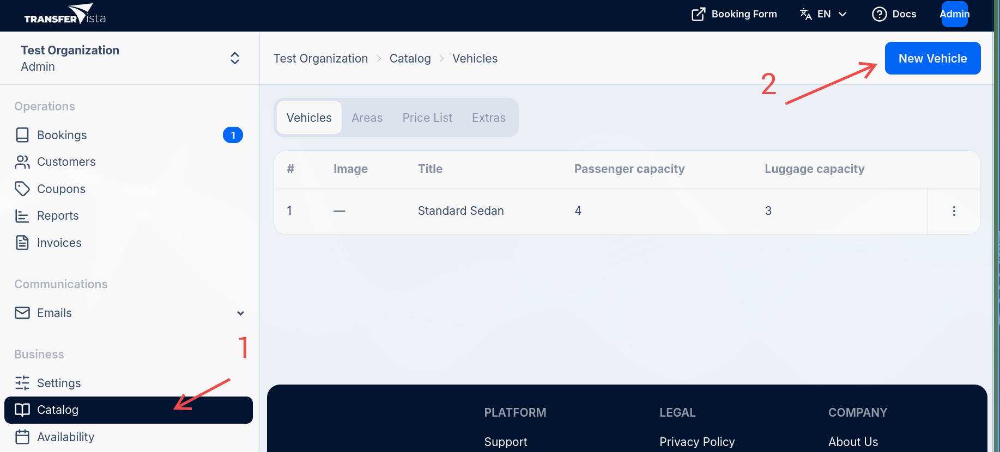
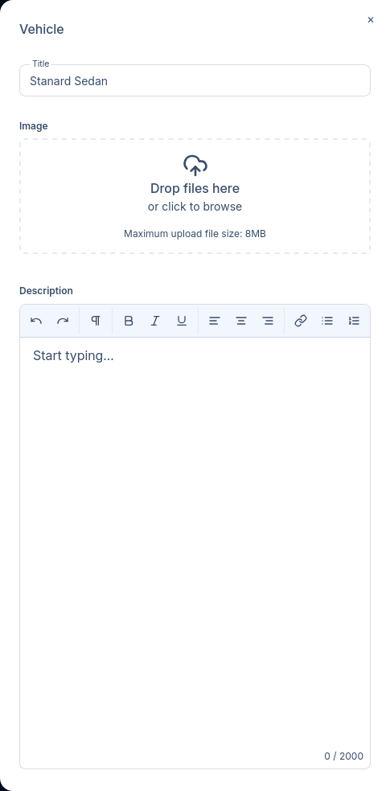
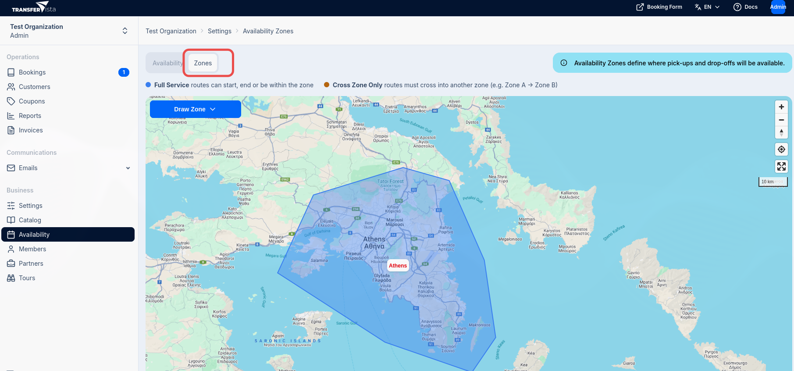
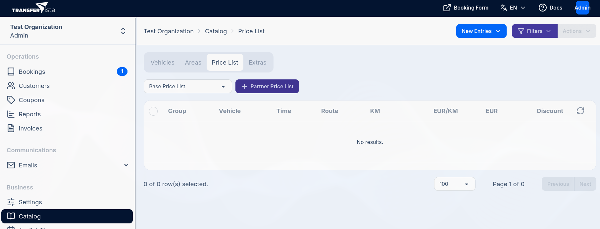
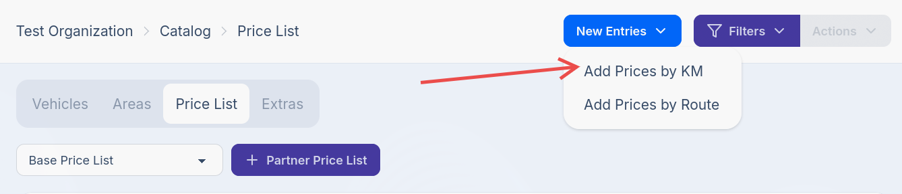
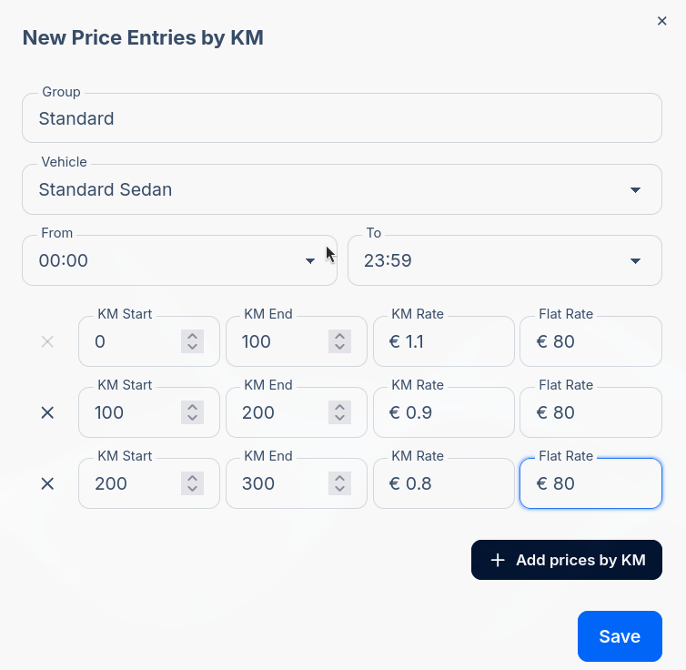
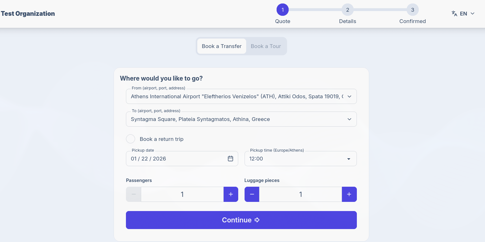
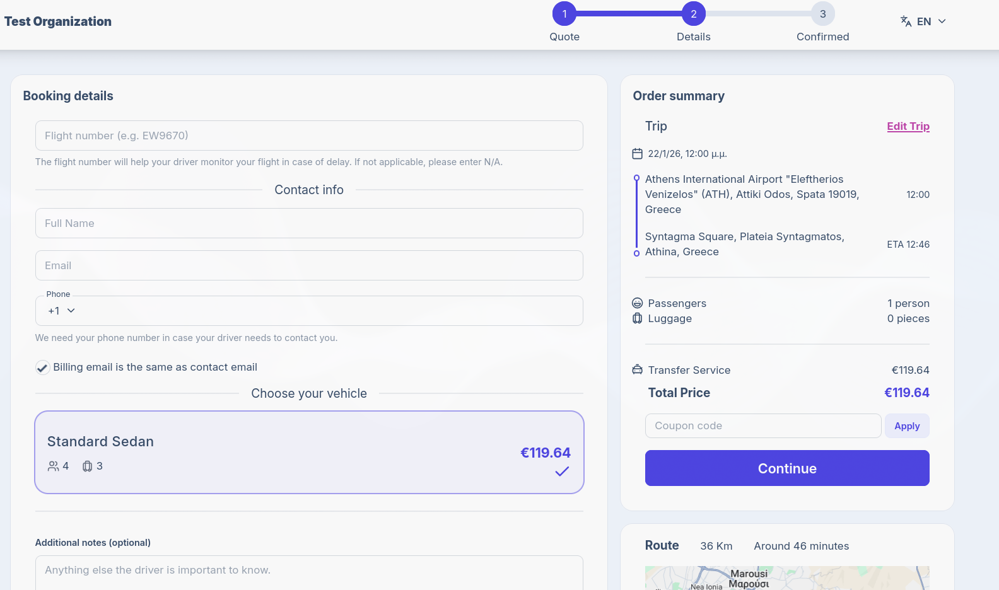

import { Steps, Aside } from '@astrojs/starlight/components';

This guide walks you through the minimum steps needed to start accepting transfer bookings.
By the end, you'll have a working booking form that customers can use.

### What You'll Set Up

To accept your first booking, you need three things configured:

1. **At least one vehicle** - Defines what customers can book
2. **An availability zone** - Defines where you operate
3. **Basic pricing** - Defines how much to charge

Let's get started.

---

## Step 1: Add Your First Vehicle

Vehicles represent what kind of vehicle a customer can book.
Each vehicle has a passenger and luggage capacity that determines which bookings it can accommodate,
and is directly linked to pricing.

<Aside>
    <div style={{fontSize: '0.9em'}}>
        Vehicles represent the types of vehicles you offer for transfers. Examples include:
        - Standard Sedan (4 passengers, 2 luggage)
        - Minivan (7 passengers, 5 luggage)
        - Luxury SUV (5 passengers, 4 luggage)
    </div>
</Aside>

<Steps>

1. Navigate to **Catalog > Vehicles** in the sidebar


2. Click the **New Vehicle** button

   

3. Fill in a title, passenger and luggage capacity, and optionally upload an image of the vehicle.

   <div style={{height: '400px', overflow: 'hidden'}}>
   
   </div>

4. Click **Save** to create the vehicle

</Steps>

---

## Step 2: Create an Availability Zone

Availability zones define the geographic areas where you offer transfer services. Customers can only book transfers to and from locations within your zones.

<Aside type="tip" title="Tip: Full Service vs Cross Zone Only">
- **Full Service**: Allows bookings within the zone (e.g., hotel-to-hotel transfers within a city)
- **Cross Zone Only**: Requires routes to cross into another zone (e.g., airport-only zone where transfers must go to/from the city)

For most businesses, start with a **Full Service** zone covering your main service area.
</Aside>

<Steps>

1. Navigate to **Availability > Zones** in the sidebar

   

2. Use the search box to find your service area on the map (e.g., "Athens, Greece")

3. Click **Draw Zone** and select **Full Service**

4. Draw your zone by clicking on the map to create a polygon. Outline your service area,
   then close the shape by clicking near the first point.

5. Enter a name for your zone (e.g., "Athens Area") and click **Save**

</Steps>

<Aside type="caution">
    The booking form will only show addresses that fall within your availability zones.
    Make sure your zone covers all the locations you want to serve, including airports, ports,
    hotels, and popular destinations.
</Aside>

---

## Step 3: Set Up Basic Pricing

Price lists determine how much customers pay for transfers. The simplest approach is to charge per kilometer.

<Steps>
1. Navigate to **Catalog > Price List** in the sidebar

   

2. Click **New Entries** and select **Add Prices by KM**

   

3. Fill in the pricing details:
   - **Group**: A name for this price group (e.g., "Standard")
   - **Vehicle**: Select your vehicle (e.g., "Standard Sedan")
   - **Time**: Set to `00:00` - `23:59` for 24-hour pricing
   - **Rate per KM**: Your rate per kilometer (e.g., 1.50)
   - **Flat Rate**: You can add a flat rate on top of the per KM rate if desired

   

4. Click **Save** to create the price entry
</Steps>

<Aside type="tip">
    The "Rate per KM" rate is multiplied by the route distance to calculate the transfer price.
    For example, a 36 km route at €1.50/km would cost €54.00. Then, a flat rate (if set) is added on
    top of that. For example, a €10 flat rate would make the total €64.00.
</Aside>

---

## Step 4: Test Your Booking Form

With vehicles, availability zones, and pricing configured, your booking form is ready to accept bookings.

<Steps>

1. Open your booking form URL in a new browser tab. Your URL follows this pattern:
   ```
   https://your-subdomain.reserve-transfer.com
   ```

   You can open the booking form by clicking the **Booking Form** button in the top-right
   of the dashboard.

   

2. Enter a pickup location in the **From** field (e.g., "Athens Airport") and select from the suggestions

3. Enter a destination in the **To** field (e.g., "Syntagma Square, Athens")

4. Select a **Pickup date** and **Pickup time**

5. Adjust **Passengers** and **Luggage** counts if needed, then click **Continue**

7. Fill in the test customer details. You'll notice 'flight number' appeared - we detected
   that the pickup location is an airport. This is now a required field

   

8. Accept the Terms of Service and click **Continue**

   {/* Screenshot: Booking form with customer details and Continue button */}

9. You'll see a confirmation page with the booking reference number

   {/* Screenshot: Thank you / confirmation page */}

</Steps>

---

## What's Next?

Congratulations! You've set up the basics and created your first test booking. Here are some recommended next steps:

### Customize Your Brand

- Upload your logo and set brand colors in [**Settings > Branding**](/docs/en/settings/04-branding)
- Add your Terms of Service and Privacy Policy URLs in [**Settings > General**](/docs/en/settings/01-general)

### Expand Your Configuration

- Add more vehicles to offer different options (minivans, luxury cars, etc.)
- Create additional price entries for different vehicle types
- Set up [availability rules](/docs/en/availability/01-rules-scheduling) for business hours
- Set up [areas](/docs/en/catalog/02-areas) and create price entries by route for popular routes
- Enable/disable [email communication notifications](/docs/en/communications/01-email-templates)
- Add [extra services](/docs/en/catalog/04-extras) like meet-and-greet, child seats, etc.

### Invite Your Team

- Add team members and drivers in [**Team > Members**](/docs/en/team/01-members)
- Configure driver permissions in [**Settings > Permissions**](/docs/en/settings/05-permissions)

### Manage Your First Real Booking

When a customer makes a booking, you'll receive an email notification. Learn more about:

- [Viewing and managing bookings](/docs/en/bookings/01-overview)
- [Assigning drivers to transfers](/docs/en/bookings/03-assigning-operators)
- [Understanding the booking status workflow](/docs/en/bookings/06-status-workflow)

---

## Troubleshooting

### "No results found" when entering addresses

This usually means the address is outside your availability zones. Make sure:
- Your zone covers the area you're searching for
- The zone boundaries include airports, ports, and key destinations

### Price shows as €0.00

Check that your price list entry:
- Has a time range that covers the booking time
- Has a KM range that covers the distance of the route
