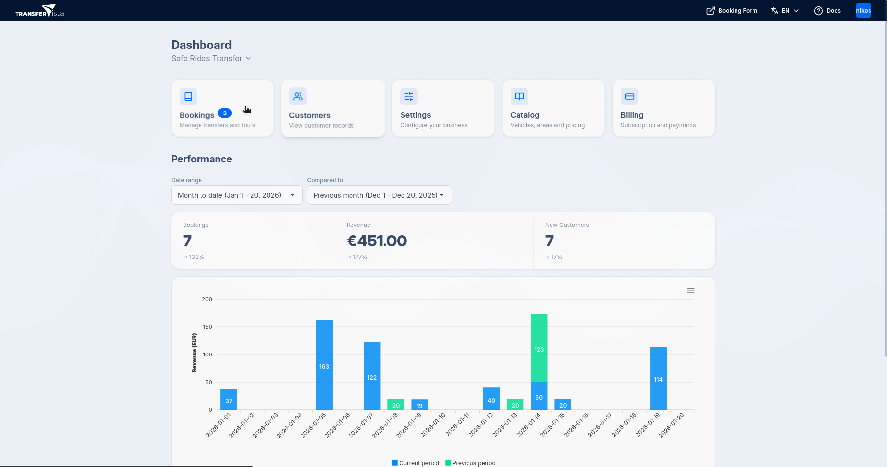
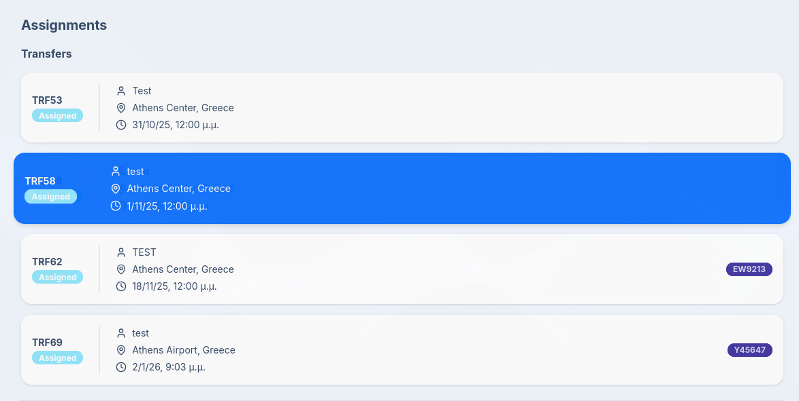

## Introduction

The Dashboard is your central hub for monitoring performance and activity.
It provides a comprehensive overview of key metrics and assignments, allowing you to stay informed and make data-driven decisions.
The Dashboard is also the place where operators can view and manage their assignments.

## Assignments

When the Driver/Operator logs into TransferVista, they are greeted with their transfer booking
assignments. They have an overview of all their upcoming and past assignments, including details
such as the pickup location and time, status, and customer information.

Pressing on an assignment opens up the detailed view of that specific transfer booking,
where the operator can see all relevant information and take necessary actions, such as marking
the transfer as picked up or completed.

To learn more about the driver's workflow, refer to the
[Driver Experience Guide](/docs/en/drivers/01-overview).
