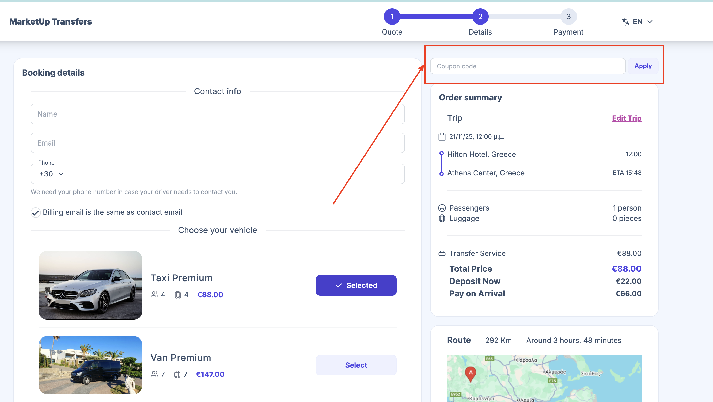

# Coupons

The **Coupons** section allows you to create and manage promotional discount codes for your transfers and tours. Coupons help you attract new customers and reward returning clients.

---

## Creating a New Coupon

You can either **generate a coupon code automatically** or **type a new one manually**.

When creating a new coupon, fill in the following fields:

- **Code** – e.g., `1D7F-B77C`  
- **Expires at** – Set the expiration date and time (dd/mm/yyyy, --:-- --)  
- **Discount Type** – Choose either **percentage** or **fixed price**  

After saving, the coupon will be available for customers to use during booking.

---

## Using Coupons at Checkout

Customers can add a coupon during checkout to apply the discount. The process is simple and intuitive.

---

## Managing Coupons

Once created, you can:

- View all active and expired coupons  
- Edit coupon details such as code, expiration date, and discount type  
- Track coupon redemption and usage  
- Deactivate coupons when needed  

Proper use of coupons helps you manage promotions effectively and drive more bookings.
