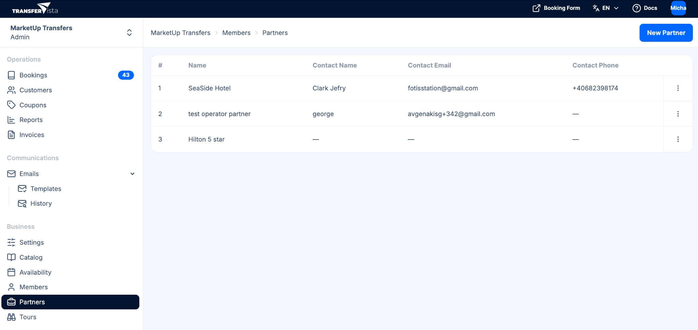

Partners in TransferVista are **external businesses** that work with your transfer company. A single partner can be set up as one or both of the following:

| Type | Description |
|------|-------------|
| **Booking Partner** | Has their own booking link, can create bookings (e.g. hotels, travel agents). Commission can be added on top of your prices. |
| **Transfer Operator Partner** | Can be assigned to fulfill transfer bookings. Receives assignment notifications and can accept or decline. |

You can configure a partner as only a Booking Partner, only a Transfer Operator, or both. Use a **Booking Partner** when an external business (e.g. hotel, travel agent) sends you bookings via their link; use a **Transfer Operator Partner** when an external company fulfills transfer assignments you assign to them.

:::tip
A single partner can be both a Booking Partner and a Transfer Operator; configure the toggles in the New Partner form.
:::

Partners are listed under **Partners** in the sidebar (under **Business**). Use **New Partner** to add one; the table shows **#**, **Name**, **Contact Name**, **Contact Email**, **Contact Phone**, and **Actions** (row menu). Click a partner or use the row actions to **view and edit** their details (name/business/title, contact name, email, phone, and capability toggles: Can Book Transfers, Can Book Tours, Is a transfer partner/operator). You can **delete** a partner from the row actions menu or from their details page.

## Partners vs team members

- **Partners** – External companies; they have their own booking URL and/or can be assigned to jobs. Managed under **Partners**.
- **Team members** (e.g. Owner, Manager, Staff, Driver) – People who log in to your admin or driver app. Managed under [Team](/docs/en/team/01-members) and [Drivers](/docs/en/team/02-drivers).

## Next steps

- [Booking Partners](/docs/en/partners/02-booking-partners) - Set up partners who book with commission
- [Transfer Operators](/docs/en/partners/03-transfer-operators) - Set up partners who fulfill transfers
