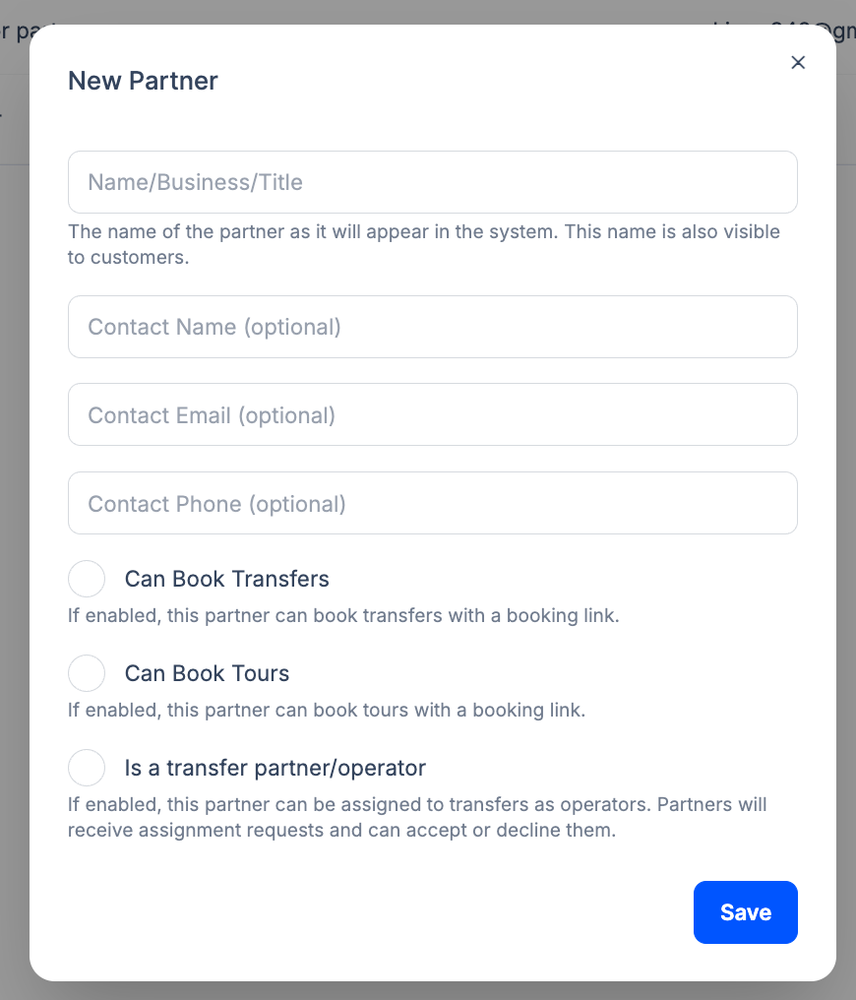

Transfer Operator Partners are external companies (e.g. other operators or subcontracted fleets) that can be **assigned** to transfer bookings. They receive assignment notifications and can accept or decline.

## Enabling a partner as Transfer Operator

In **Partners**, click **New Partner** (or open an existing partner). In the form, enter the partner **name/business/title** and **contact information** (name, email, phone), then enable **Is a transfer partner/operator**. The description in the UI: *"If enabled, this partner can be assigned to transfers as operators. Partners will receive assignment requests and can accept or decline them."* Click **Save**.

That partner then appears in the operator assignment dropdown on [Booking Details](/docs/en/bookings/02-booking-details). When you assign them to a booking, they receive the assignment (e.g. by email) and can confirm or decline.

:::note
The same New Partner form is used: enable **Is a transfer partner/operator** so the partner appears in the operator dropdown on Booking Details.
:::

## Difference from internal drivers

- **Internal drivers** – Added under [Team > Drivers](/docs/en/team/02-drivers); they log in to the driver app and see their assignments.
- **Transfer Operator Partners** – External companies; assignment and acceptance workflow is used instead of (or in addition to) the driver app.

## Related pages

- [Partners Overview](/docs/en/partners/01-overview)
- [Booking Partners](/docs/en/partners/02-booking-partners) - Partners who book with commission
- [Assigning Operators](/docs/en/bookings/03-assigning-operators) - How to assign a driver or partner to a booking
