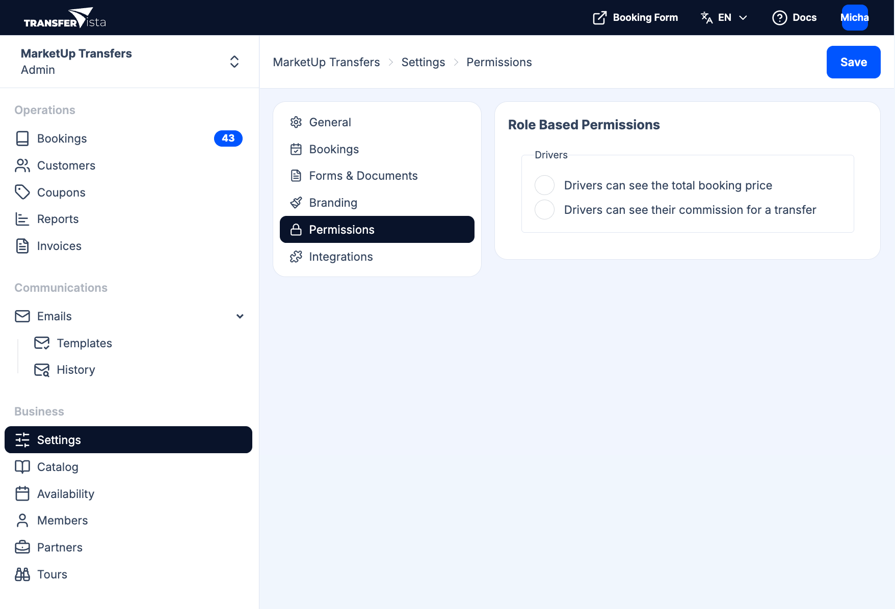

To access Permissions, go to **Settings** in the sidebar and select **Permissions**.

Here you control what **drivers** (operators) can see when they log in. This keeps sensitive information hidden while giving them what they need to do the job.

## Reference

Under **Role Based Permissions** you will see a **Drivers** section with two options:

| Option | Description |
|--------|-------------|
| **Drivers can see the total booking price** | When enabled, drivers see the booking total and payment amounts in their assignment view. Turn off to hide pricing from drivers. |
| **Drivers can see their commission for a transfer** | When enabled, drivers see their commission for each booking. Turn off to keep commission confidential. |

These options apply to the driver's view of their [assignments](/docs/en/drivers/02-viewing-assignments) and booking details.

:::note
**Who these apply to:** The Permissions toggles apply to everyone who has the **Driver** role (invited via [Team > Members](/docs/en/team/01-members)). There is one set of driver permissions for your organization; all drivers see (or don't see) price and commission according to these settings.
:::

:::tip
Drivers have a limited role: they only see their own assignments and can update status (e.g. Picked up, Completed). They do not have access to settings, catalog, billing, or other users' data.
:::

After making changes, click **Save** in the top right corner to apply your updates.

## Related

- [Driver Experience Overview](/docs/en/drivers/01-overview) - What drivers see when they log in
- [Team > Drivers](/docs/en/team/02-drivers) - Add and manage driver accounts
