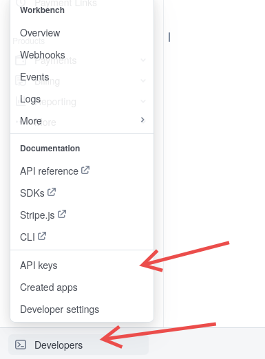
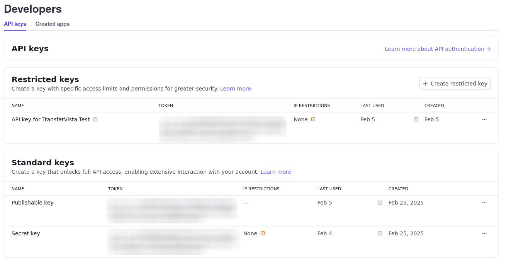

import { Steps } from '@astrojs/starlight/components';

To access Integrations, go to **Settings** in the sidebar and select **Integrations**.

## Stripe

Connect your Stripe account to accept online payments from customers.

| Field | Description |
|-------|-------------|
| **Stripe Publishable Key** | Your Stripe publishable key (starts with `pk_`). Found in your Stripe Dashboard under Developers > API keys. |
| **Stripe Secret/Restricted Key** | Your Stripe secret key (starts with `sk_`) or restricted key (starts with `rk_`) with payment permissions. Found in your Stripe Dashboard under Developers > API keys. |

:::note
Once Stripe is configured, you can enable online payment options in [Bookings Settings](/docs/en/settings/02-bookings/#payment-methods).
:::

### Setting Up Stripe

<Steps>

1. Create a [Stripe account](https://stripe.com) if you don't have one

2. In your Stripe Dashboard, go to **Developers > API keys**

    <div style={{ display: 'flex', justifyContent: 'center', margin: '1rem 0' }}>
        
    </div>

3. Create a **Restricted** key

    <Steps>

        1. Click **Create restricted key**

        2. When asked "How will you use this API key?", select "Providing this key to another website". Press continue.

        3. Name the key (e.g. "TransferVista") and provide the following URL:

            ```
            https://reserve-transfer.com
            ```

        4. Click Create restricted key. A pop-up will show your restricted key (starts with `rk_`). Copy this key and paste it to the **Stripe Secret key** field in TransferVista.

    </Steps>

    

4. Find your publishable key (starts with `pk_`) under "Standard keys" and copy it to the **Stripe Publishable key** field in TransferVista.

5. Click **Save**

</Steps>

:::tip
You can use **test keys** (starting with `pk_test_` and `sk_test_`) when testing. Then, switch
to **live keys** (starting with `pk_live_` and `sk_live_`) when you're ready to accept real payments.
:::

## Google Calendar

Sync your bookings to Google Calendar to keep track of upcoming transfers.

When connected, TransferVista automatically creates calendar events for new bookings, making it easy to view your schedule alongside other appointments.

### Connecting Google Calendar

<Steps>

1. Click **Sign in with Google**

2. Select your Google account

3. Grant TransferVista permission to access your calendar

4. Once connected, bookings will sync to your Google Calendar

</Steps>

:::caution
You must explicitly grant calendar access during the sign-in process. If you skip this step,
you will see the error: "Failed to load calendars"
:::

:::note
To send calendar events, you must be the owner of the calendar. Shared calendars where you only have edit access will not work.
:::

## Google Analytics

Track booking form visitors and conversions with Google Analytics.

| Field | Description |
|-------|-------------|
| **GA Measurement ID** | Your Google Analytics 4 Measurement ID (format: `G-XXXXXXXXXX`). Found in your Google Analytics property settings. |

### Setting Up Google Analytics

<Steps>

1. Create a [Google Analytics 4](https://analytics.google.com) property if you don't have one

2. Go to **Admin > Data Streams** and select your web stream

3. Copy your **Measurement ID** (starts with `G-`)

4. Paste it into the GA Measurement ID field in TransferVista

5. Click **Save**

</Steps>

## Google Ads

Track conversions from your Google Ads campaigns to measure advertising effectiveness.

| Field | Description |
|-------|-------------|
| **Conversion ID** | Your Google Ads conversion ID (format: `AW-XXXXXXXXX`). Found in your Google Ads account under Tools > Conversions. |
| **Conversion Label** | The conversion label for the specific action you want to track. Created when you set up a conversion action in Google Ads. |

:::note
Google Analytics integration is required for Google Ads tracking to work. Configure Google Analytics first before setting up Google Ads.
:::

### Setting Up Google Ads Conversion Tracking

<Steps>

1. In your [Google Ads account](https://ads.google.com), go to **Tools & Settings > Conversions**

2. Create a new conversion action for website bookings

3. Copy the **Conversion ID** and **Conversion Label** from the tag setup

4. Paste both values into TransferVista

5. Click **Save**

</Steps>

After making changes to any integration, click **Save** in the top right corner to apply your updates.
