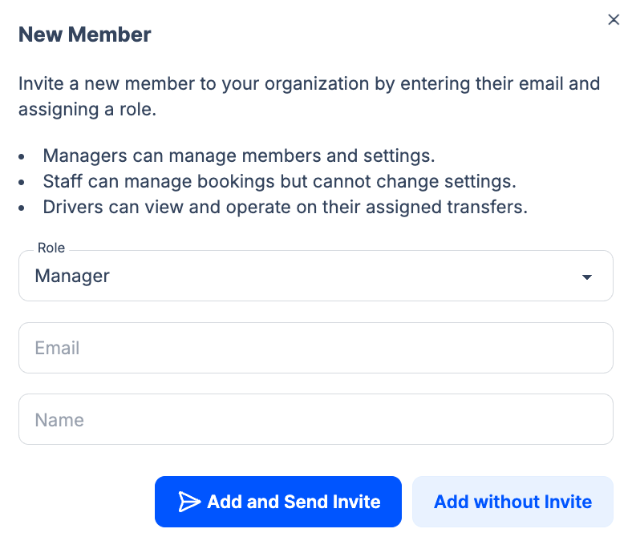

Team **Members** are people who log in to your TransferVista admin or driver app. From **Team > Members** (sidebar) you can view the member list, invite new members, change roles, and remove access.

## New Member form

To add someone, go to **Team > Members** and click **New Member**. The modal says: *"Invite a new member to your organization by entering their email and assigning a role."*

**Roles in the form:**

- **Managers** can manage members and settings.
- **Staff** can manage bookings but cannot change settings.
- **Drivers** can view and operate on their assigned transfers.

Enter **Role** (dropdown: Manager, Staff, or Driver), **Email**, and **Name**. Then choose:

- **Add and Send Invite** – Sends an email invitation; the member signs in via the link.
- **Add without Invite** – Adds the member without sending an email (e.g. you will share credentials another way).

:::note
The Owner role is the account owner and is not added via New Member; only Manager, Staff, and Driver can be invited.
:::

## Roles reference

| Role | Typical access |
|------|----------------|
| **Owner** | Full access: settings, billing, all bookings, team, and catalog. (The account owner; not added via New Member.) |
| **Manager** | Can manage members and settings. |
| **Staff** | Can manage bookings but cannot change settings. |
| **Driver** | Driver app only: view and operate on assigned transfers. No admin panel. See [Driver Experience](/docs/en/drivers/01-overview). |

Exact permissions can vary by your plan. You can change a member's role or remove a member’s access at any time from the member list.

## Related pages

- [Drivers](/docs/en/team/02-drivers) - Add and manage driver profiles (used for assignment)
- [Permissions](/docs/en/settings/05-permissions) - What drivers can see (e.g. price, commission)
- [Driver Experience Overview](/docs/en/drivers/01-overview)
