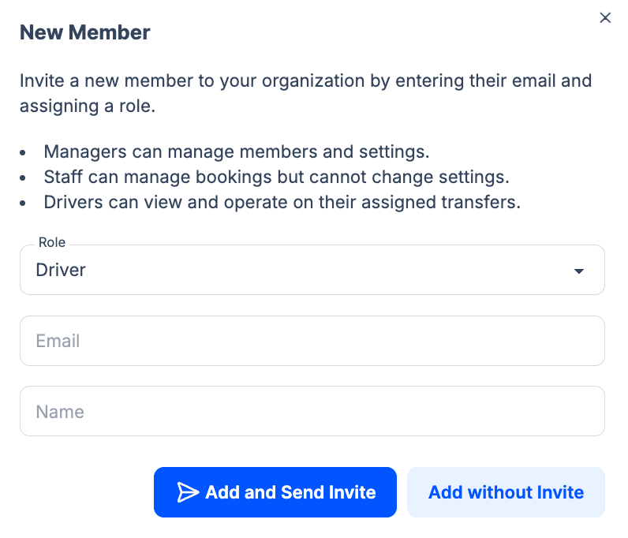

**Drivers** (operators) are the people or vehicles that fulfill transfer bookings. You add them under **Team > Drivers** so they can be [assigned](/docs/en/bookings/03-assigning-operators) to bookings and, if they have a driver account, see their assignments in the driver app.

## Giving a driver a login (Driver role)

To let a driver log in to the [driver app](/docs/en/drivers/01-overview) (view assignments, mark Picked Up/Completed), invite them as a **Member** with the **Driver** role. In **Team > Members**, click **New Member**, choose **Role: Driver**, enter their **Email** and **Name**, then **Add and Send Invite** or **Add without Invite**. The UI describes the Driver role: *"Drivers can view and operate on their assigned transfers."*

## Adding a driver profile

In **Team > Drivers** you create the driver profile (used for assignment) with:

- **Name** (and optionally photo)
- **Phone number** (for contact and assignment notifications)
- **Commission** (e.g. percentage or fixed amount per booking)

Commission is calculated per booking (e.g. a percentage of the transfer total or a fixed amount per job). Once saved, the driver appears in the operator dropdown on [Booking Details](/docs/en/bookings/02-booking-details). You can assign them to transfers and they will receive notifications if configured. Driver availability (when a driver is available for assignments) may be configurable per driver if your plan supports it. Performance tracking (e.g. completed transfers, revenue per driver) may appear in [Reports](/docs/en/reports/01-generating-reports) or on the driver profile depending on your plan.

## Driver accounts (login)

After creating the driver profile above, use **Team > Members** and add them with the **Driver** role (see [Members](/docs/en/team/01-members)). Link that member to this driver profile so the same person appears in Team > Drivers (for assignment) and in the [driver app](/docs/en/drivers/01-overview) (for status updates).

:::tip
Link the Member (Driver role) to the driver profile in Team > Drivers so the same person appears in the assignment dropdown and in the driver app.
:::

## Related pages

- [Members](/docs/en/team/01-members) - Invite users and set roles
- [Assigning Operators](/docs/en/bookings/03-assigning-operators) - Assign a driver to a booking
- [Driver Experience](/docs/en/drivers/01-overview) - What drivers see when they log in
- [Permissions](/docs/en/settings/05-permissions) - Hide price or commission from drivers
