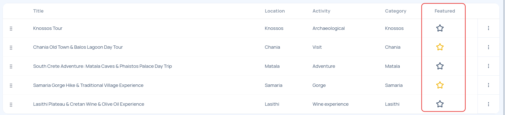
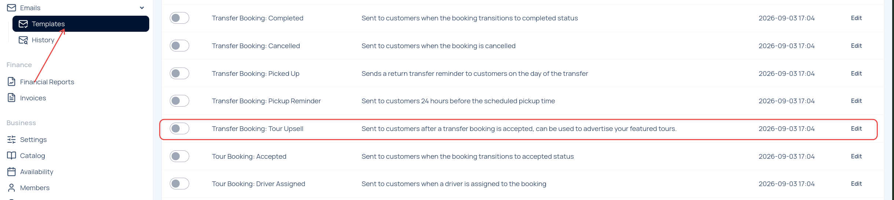
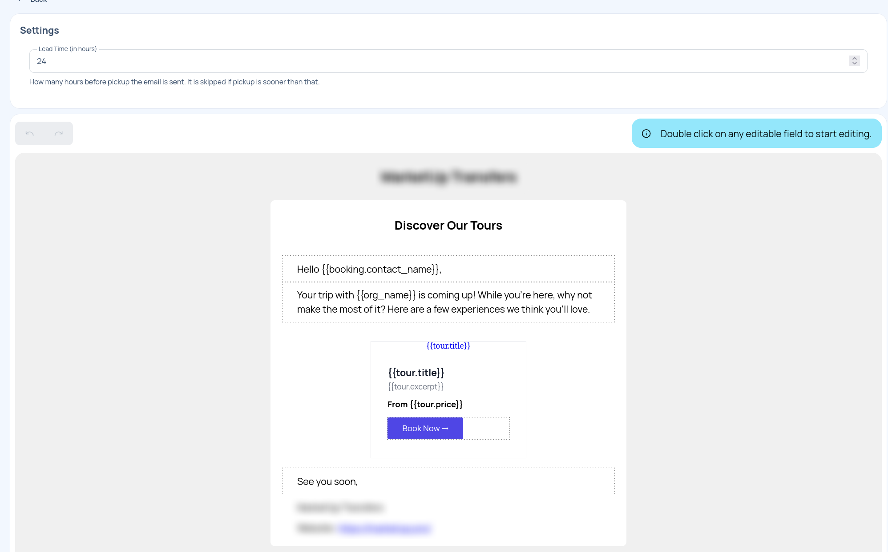

Featured tours are promoted through a separate upsell email sent to customers who book a transfer. Select the tours you want to advertise, then enable and configure the tour upsell email template.

## Mark a Tour as Featured

1. Open the TransferVista Admin dashboard.
2. Navigate to `Tours` from the left sidebar.
3. Find the tour you want to promote in the tours list.
4. Click the star in the `Featured` column.

An outlined star means the tour is not featured. A highlighted star means it is featured and can be included in the tour upsell email.

Repeat these steps for each tour you want to advertise. To stop promoting a tour, click its highlighted star again.

## Enable the Tour Upsell Email

1. Open `Emails` in the left sidebar.
2. Select `Templates`.
3. Find `Transfer Booking: Tour Upsell` in the template list.
4. Turn on the template toggle.

This email is sent to customers after their transfer booking is accepted and advertises your featured tours.

## Configure the Email

Select `Edit` next to `Transfer Booking: Tour Upsell` to open its settings.

### Set the Lead Time

In the `Lead Time (in hours)` field, enter how many hours before the customer's pickup the email should be sent. For example, a value of `24` sends the email 24 hours before pickup.

The email is skipped when the pickup is sooner than the configured lead time.

### Customize the Content

Edit the email content to match your brand and messaging. The template can include:

- A greeting addressed to the customer
- Introductory text explaining the tour recommendations
- Featured tour cards with the tour title, excerpt, price, and `Book Now` link
- A closing message and your company details

Double-click an editable field in the email preview to start editing. Save the template after making your changes.

## How It Works

When a customer books a transfer:

1. The transfer booking is accepted.
2. TransferVista waits until the configured lead time before pickup.
3. The customer receives the tour upsell email.
4. The email displays the tours currently marked as featured.

Only featured tours are advertised. If no tours are marked as featured, there are no tour recommendations to promote.
