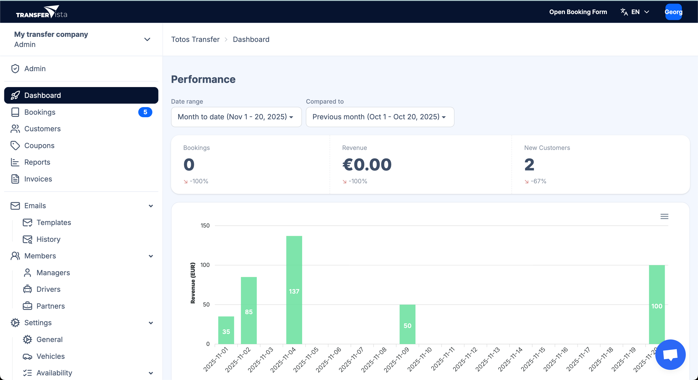

Le **tableau de bord Transfervista** est l’espace central où les prestataires de transfert, les hôtels et les administrateurs peuvent surveiller les performances de leur activité en un coup d’œil.  
Il fournit des informations en temps réel sur les réservations, les revenus, l’activité des clients et d’autres indicateurs opérationnels clés.

## Ce que vous pouvez voir

### **1. Résumé des performances**

En haut du tableau de bord, vous pouvez consulter les indicateurs essentiels de votre activité :

- **Nombre total de réservations** dans la période sélectionnée  
- **Revenus générés**  
- **Nouveaux clients** acquis  
- **Variations en pourcentage** par rapport à la période précédente  

Ces métriques vous permettent de comprendre instantanément la santé de votre activité de transferts.

### **2. Comparaison par période**

Le tableau de bord vous permet de comparer vos performances sur différentes périodes :

- Sélectionnez une période (ex : *Mois en cours*)  
- Comparez-la avec une autre (ex : *Mois précédent*)  

Cela facilite la détection des tendances, de la saisonnalité et de la croissance.

### **3. Graphique des revenus**

Un graphique affiche les revenus par jour :

- Visualise les gains quotidiens  
- Permet d’identifier les jours de forte demande et les périodes plus calmes  
- Utile pour la planification opérationnelle et l’allocation des ressources  

## Ce que vous pouvez faire

### **Surveiller la santé de votre activité**

Suivez en temps réel les réservations, les clients et les revenus afin de comprendre les performances globales de votre entreprise.

### **Identifier les tendances**

Utilisez les outils de comparaison et les graphiques pour repérer les opportunités de croissance, les pics saisonniers et les éventuels points de blocage.

### **Planifier vos ressources**

En visualisant l’activité quotidienne, vous pouvez mieux programmer les chauffeurs, attribuer les véhicules et préparer les journées chargées.

### **Accéder rapidement aux outils de gestion**

Le tableau de bord sert de point d’entrée principal pour la gestion des réservations, les fiches clients, la facturation, la gestion de l’équipe et les paramètres du système.
