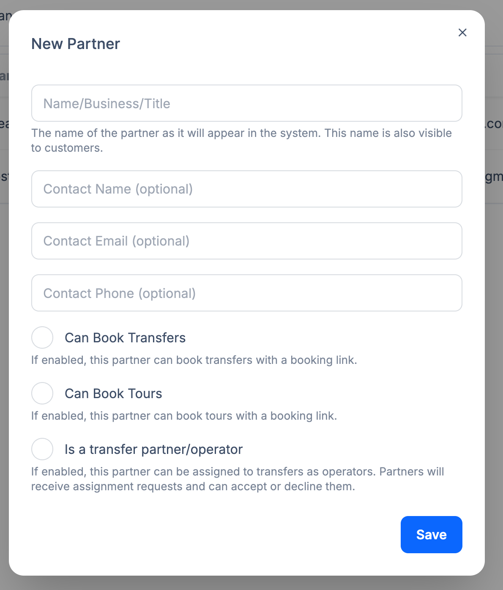

---

title: Membres

description: Gérez tous les membres de votre système Transfervista, y compris les administrateurs, chauffeurs et partenaires.

---

# Membres

La section **Membres** vous permet de gérer tous les utilisateurs qui interagissent avec la plateforme Transfervista.  
Les membres sont divisés en trois catégories principales, chacune ayant des permissions et rôles différents.

---

## 1. Administrateurs

Les administrateurs ont un accès complet au système. Ils peuvent :

- Gérer toutes les réservations, clients, coupons et rapports  
- Configurer les paramètres globaux du système  
- Assigner des chauffeurs et partenaires  
- Consulter toutes les activités sur la plateforme  

Les administrateurs sont responsables de la gestion globale et de la supervision du système.

---

## 2. Chauffeurs

Les chauffeurs sont des utilisateurs assignés à des transferts ou excursions spécifiques. Une fois assignés, ils peuvent :

- Se connecter à leur propre interface dans Transfervista  
- Voir tous les transferts et excursions qui leur sont attribués  
- Effectuer des actions telles que **marquer une prise en charge comme effectuée** ou **confirmer la livraison d’un passager**  

Les chauffeurs n’ont pas accès aux paramètres globaux du système ni aux données des autres utilisateurs ; leur accès est limité aux transferts dont ils sont responsables.

---

## 3. Partenaires

Les partenaires sont des collaborateurs externes et sont divisés en trois types :

### a) Partenaires de réservation

- Ce sont des partenaires comme des hôtels, hébergements, agences de voyage ou toute entreprise pouvant **réserver des transferts ou excursions**.  
- Ils envoient des réservations à Transfervista mais n’assurent pas l’exécution eux-mêmes.

### b) Partenaires opérateurs

- Entreprises qui **reçoivent des réservations pour exécuter les transferts ou excursions** avec leur propre flotte et chauffeurs.  
- Transfervista envoie une **notification par e-mail** à l’entreprise pour qu’elle accepte la réservation.  
- Comme l’opérateur utilise ses propres chauffeurs, Transfervista **ne sait pas quel chauffeur est assigné**, seulement que l’entreprise réalisera le transfert.

### c) Partenaires combinés

- Ces partenaires peuvent **réserver et exécuter des transferts ou excursions**.  
- Ils ont accès pour créer des réservations et gérer également les chauffeurs pour réaliser les services.

---

Une gestion correcte des membres garantit un fonctionnement fluide, des responsabilités claires et un suivi approprié de tous les transferts et excursions.
