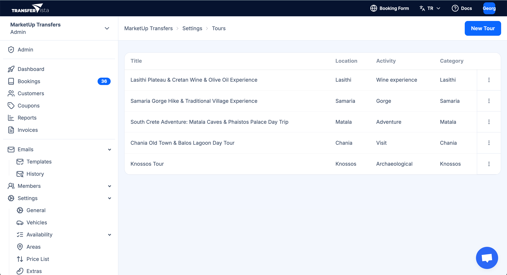
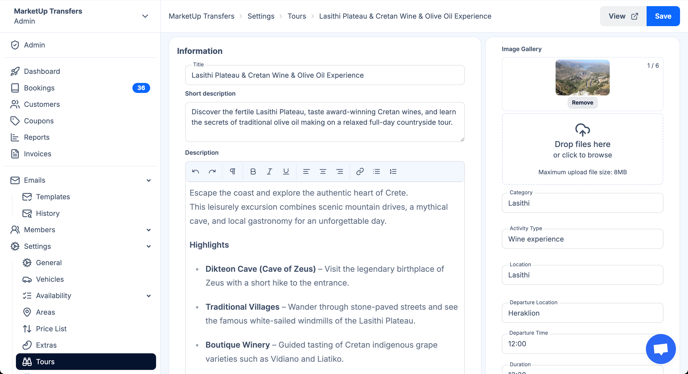
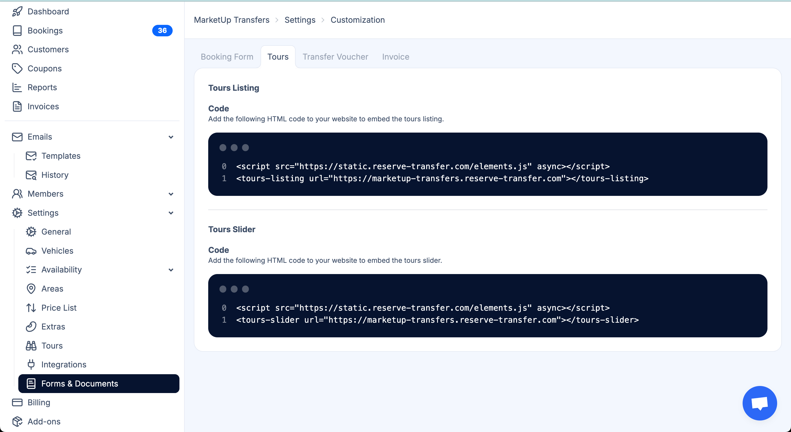
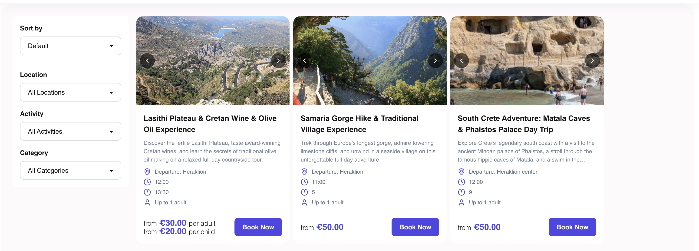
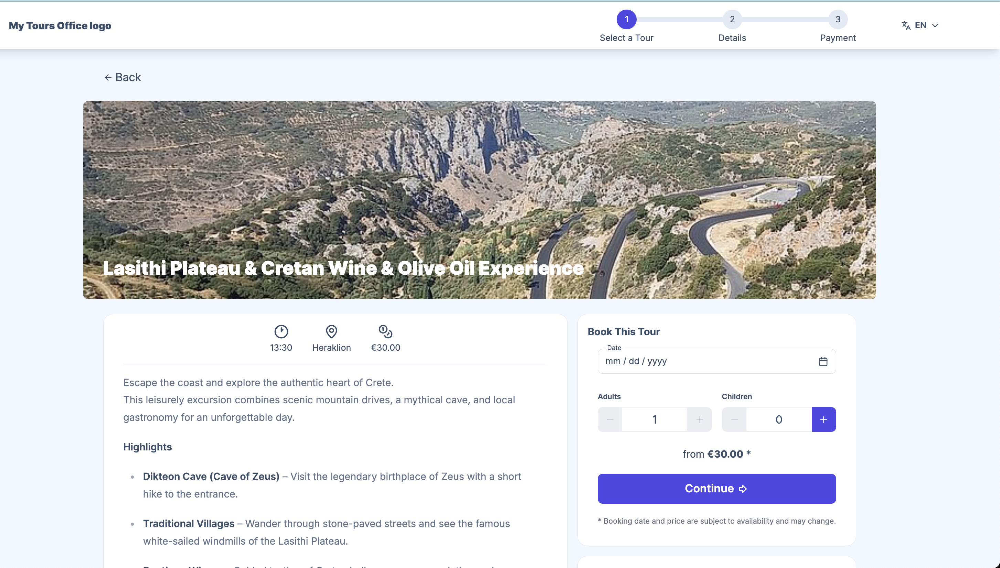

# Tour

### Creare il tuo primo Tour

1. **Accedi al Modulo Tour**
   - Accedi al pannello Admin di TransferVista
   - Vai su `Impostazioni > Tour` dal menu laterale sinistro
   - Clicca sul pulsante blu `Nuovo Tour` nell’angolo in alto a destra

2. **Imposta le Informazioni di Base**
   
   Compila i dettagli essenziali del tour:
   
   - **Titolo**: Dai al tour un nome chiaro e descrittivo (es. "Altopiano di Lasithi & Degustazione di Vini e Olio d’Oliva Cretesi")
   - **Descrizione Breve**: Una descrizione accattivante di 1-2 frasi che comparirà nell’elenco dei tour
   - **Categoria**: Assegna una categoria basata sulla località (es. Lasithi, Samaria, Chania)
   - **Tipo di Attività**: Specifica il tipo di tour (Esperienza enologica, Gola, Avventura, Archeologico, Visita)

3. **Crea la Descrizione Dettagliata**
   
   Usa l’editor di testo avanzato per creare la descrizione completa del tour:
   
   - Scrivi un paragrafo introduttivo coinvolgente
   - Aggiungi una sezione **Punti Salienti** con elenco puntato
   - Inserisci dettagli specifici su ogni tappa o attività
   - Usa grassetto, corsivo e liste per migliorare la leggibilità

4. **Configura i Dettagli del Tour**

   Imposta i parametri operativi:
   
   - **Località**: Identificatore principale della zona
   - **Luogo di Partenza**: Dove i clienti verranno prelevati (es. "Heraklion")
   - **Orario di Partenza**: Orario di inizio in formato 24h (es. 12:00)
   - **Durata**: Durata in ore
   - **Capacità**: Numero massimo di partecipanti (mostrato come "Fino a X adulti")

5. **Aggiungi Immagini**
   
   - Carica fino a 6 immagini di alta qualità (max 8MB ciascuna)
   - La prima immagine diventa quella principale del tour
   - Usa foto orizzontali che mostrano le attrazioni principali
   - Clicca `Rimuovi` per eliminare immagini indesiderate

6. **Imposta i Prezzi**
   
   Configura la struttura tariffaria:
   
   - Prezzo adulti (mostrato come "da €XX.XX per adulto")
   - Prezzo bambini (mostrato come "da €XX.XX per bambino")
   - I prezzi sono visualizzati con la tariffa base in evidenza

7. **Salva il Tour**
   
   Clicca sul pulsante blu `Salva` nell’angolo in alto a destra

## Incorporare i Tour sul tuo Sito Web

TransferVista fornisce codici embed HTML pronti all’uso per mostrare i tour in modo professionale su qualsiasi sito.

### Opzioni di Embed Disponibili

#### 1. Elenco Tour (Catalogo Completo)

Mostra tutti i tour in una griglia filtrabile con opzioni di ordinamento e filtri.

**Caratteristiche:**
- Ordinamento (Predefinito, Prezzo, Durata, ecc.)
- Filtro per località
- Filtro per tipo di attività
- Filtro per categoria
- Layout responsive con immagini
- Mostra i prezzi
- Pulsanti "Prenota Ora"

#### 2. Slider Tour (Carosello)

Mostra i tour in un carosello interattivo, ideale per homepage o sezioni promozionali.

### Come Incorporare i Tour nel Sito

1. **Accedi ai Codici Embed**
   - Accedi al pannello admin TransferVista
   - Vai su `Impostazioni > Moduli & Documenti`
   - Clicca sulla scheda `Tour`
   - Vedrai due sezioni: "Elenco Tour" e "Slider Tour"

2. **Scegli lo Stile di Visualizzazione**
   - **Elenco Tour**: Mostra tutti i tour con filtri – ideale per pagine dedicate
   - **Slider Tour**: Mostra un carosello – perfetto per la homepage

3. **Copia il Codice Embed**
   - Ogni sezione contiene una casella con codice HTML pronto
   - Clicca nella casella per selezionare tutto
   - Copia l’intero codice (generalmente 2 righe)
   - Assicurati di copiarlo completamente

4. **Aggiungi al tuo Sito**
   - Apri l’editor del tuo sito (WordPress, Wix, Squarespace, HTML, ecc.)
   - Vai alla pagina dove vuoi mostrare i tour
   - Incolla il codice nell’area HTML
   - Se usi un page builder, cerca un blocco "HTML" o "Codice personalizzato"
   - Funziona su qualsiasi piattaforma senza configurazione aggiuntiva

5. **Testa l’Integrazione**
   - Salva e pubblica la pagina
   - Visita il tuo sito per vedere i tour
   - Prova il processo di prenotazione con "Prenota Ora"
   - Testa filtri e ordinamento (per il catalogo)
   - Controlla da mobile

## L’Esperienza di Prenotazione

### Flusso di Prenotazione per il Cliente

I clienti seguiranno un processo fluido in 3 passaggi:

**Passo 1: Seleziona un Tour**
- Sfoglia i tour con immagini e descrizioni
- Visualizza dettagli chiave: orario, località, prezzo
- Leggi la descrizione completa e i punti salienti
- Clicca "Prenota Ora"

**Passo 2: Inserisci i Dati**
- Seleziona la data dal calendario
- Scegli numero di adulti e bambini
- Il prezzo si aggiorna automaticamente: "da €XX.XX *"
- Nota: "* Data e prezzo sono soggetti a disponibilità e possono cambiare"
- Clicca "Continua"

**Passo 3: Completa il Pagamento**
- Inserisci i dati del cliente
- Effettua il pagamento
- Ricevi la conferma

### Funzionalità di Visualizzazione dei Tour

Ogni scheda tour mostra:
- Immagine principale
- Titolo
- Breve descrizione
- Località con icona pin
- Orario con icona orologio
- Durata con icona orologio
- Capacità
- Prezzi
- Pulsante "Prenota Ora"

## Gestione delle Prenotazioni Tour

### Visualizzare le Prenotazioni

Puoi accedere tramite:
- Sezione **Prenotazioni** nel menu laterale (con badge es. "36")
- Visualizza tutte le prenotazioni tour insieme ai transfer
- Filtra e ordina i dati

### Gestione Tour

L’elenco mostra:
- Titolo
- Località
- Tipo di attività
- Categoria
- Menu opzioni (⋮)

Azioni rapide:
- Modifica tour
- Visualizza prenotazioni
- Duplica tour
- Archivia/Elimina tour

## Domande Frequenti

### Configurazione

**D: Quanti tour posso creare?**  
R: Non c’è un limite indicato. Crea tutti i tour necessari.

**D: Posso personalizzare l’aspetto dell’embed?**  
R: Il design è già professionale e responsive. Per modifiche avanzate, contatta il supporto.

**D: Quali formati supportano le immagini?**  
R: JPG e PNG fino a 8MB.

**D: Posso impostare prezzi diversi per date diverse?**  
R: L’interfaccia mostra prezzi base. Per prezzi stagionali, consulta la sezione "Listino Prezzi".

**D: Come gestisco lingue diverse?**  
R: La piattaforma supporta multilingua. Configura le lingue in Impostazioni.

### Gestione Prenotazioni

**D: Come pagano i clienti?**  
R: Il pagamento avviene nel Passo 3 dopo aver inserito i dati.

**D: Posso impostare limiti di capacità?**  
R: Sì, tramite le impostazioni del tour.

**D: Cosa succede se un tour è al completo?**  
R: La disponibilità viene gestita automaticamente.

**D: I clienti possono prenotare per lo stesso giorno?**  
R: Sì, se il tour non è ancora partito e c’è disponibilità.

### Integrazione Sito Web

**D: Serve sapere programmare?**  
R: No, basta copiare e incollare il codice.

**D: Funziona da mobile?**  
R: Sì, è completamente responsive.

**D: Posso incorporare i tour su più pagine?**  
R: Sì, usa lo stesso codice dove vuoi.

**D: Quanto velocemente appaiono le modifiche?**  
R: Subito, senza aggiornare il codice.

### Funzionalità Avanzate

**D: Posso offrire tour condivisi e privati?**  
R: Sì, creando tour separati o gestendo capacità diverse.

**D: Come gestisco richieste speciali?**  
R: Attraverso la sezione Clienti e i template email.

**D: Posso integrare tour con un altro sistema di prenotazione?**  
R: Controlla le integrazioni disponibili in Impostazioni.

**D: Ci sono report sulle performance?**  
R: Sì, nella sezione Report.

## Best Practice

### Descrizioni
- Metti in evidenza gli aspetti migliori
- Usa elenchi puntati
- Aggiungi informazioni pratiche
- Specifica cosa è incluso

### Prezzi
- Imposta prezzi competitivi
- Offri sconti bambini
- Considera tutti i costi
- Rivaluta stagionalmente

### Immagini
- Usa foto professionali
- Mostra esperienze reali
- Includi persone quando possibile
- Ottimizza le immagini per il web

### Esperienza Cliente
- Rispondi velocemente
- Mantieni le info aggiornate
- Imposta aspettative realistiche
- Richiedi feedback

## Assistenza

**Documentazione:**  
- Link `Docs` nella barra in alto  
- Impostazioni > Generale  
- Impostazioni > Disponibilità  

**Supporto:**  
- Chat widget  
- Email dal pannello admin  
- Template per comunicazioni clienti

## Prossimi Passi

1. Crea il tuo primo tour
2. Aggiungi immagini di qualità
3. Imposta prezzi e capacità
4. Incorpora i tour sul sito
5. Testa tutto il processo
6. Promuovi i tour
7. Monitora e ottimizza

I tuoi tour sono ora pronti per ricevere prenotazioni e offrire esperienze indimenticabili!

